# 数据库实体关系图

> English edition: [Database entity relationship diagram](en/database-erd.md).

> 当前 schema：Alembic `20260813_0038`  
> 生成来源：`tricycle_reaction_db.db.models.metadata`  
> 完整性：51 张表、605 个列、
> 75 条外键约束，未省略物理表、列或 FK。

本文区分物理持久化后端和进程内对象。RustFS 与 PostgreSQL 不共享事务；
`artifact_file` 只保存 RustFS locator、内容 hash 和状态，原始逻辑字节不进入
PostgreSQL。除原始 artifact object 外，所有领域实体和科学结果都存放在
PostgreSQL；RDKit cartridge、ARRAY、JSONB 和 BYTEA 是 PostgreSQL 内部列类型，
不是独立数据库后端。RustFS 磁盘层透明压缩可压缩对象，但 S3 GET/HEAD、
Artifact SHA-256 和大小仍以原始逻辑字节为准。新上传对象按 UTC 小时分区，
上传失败由生命周期 Hook 定点补偿；可选 GC 的水位和运行审计存放 PostgreSQL；
对象是否保留以 ArtifactFile 关系为准。

## 物理存储边界

```mermaid
flowchart TB
    subgraph PERSISTENT["持久化后端"]
        direction LR
        subgraph RUSTFS["RustFS / S3-compatible object storage"]
            rustfs_object["原始 artifact object bytes<br/>Gaussian / ORCA / input / manifest"]
        end
        subgraph POSTGRES["PostgreSQL 18 + RDKit cartridge"]
            direction TB
            subgraph PG_GROUP_1["身份、组织与项目授权"]
                user_account["user_account"]
                external_identity["external_identity<br/>OIDC issuer + subject"]
                organization["organization"]
                organization_membership["organization_membership"]
                project["project"]
                project_membership["project_membership"]
            end
            subgraph PG_GROUP_2["Artifact、解析与计算帧"]
                artifact_file["artifact_file<br/>RustFS pointer + visibility"]
                artifact_ingestion["artifact_ingestion"]
                calculation_protocol["calculation_protocol"]
                parse_revision["parse_revision"]
                calculation_segment["calculation_segment"]
                calculation_frame["calculation_frame"]
            end
            subgraph PG_GROUP_3["RustFS 增量垃圾回收"]
                storage_garbage_collection_state["storage_garbage_collection_state<br/>PostgreSQL watermark"]
                storage_garbage_collection_run["storage_garbage_collection_run<br/>audit"]
            end
            subgraph PG_GROUP_4["化学身份与几何"]
                molecular_formula["molecular_formula"]
                molecular_topology["molecular_topology<br/>RDKit mol"]
                molecular_topology_derivation["molecular_topology_derivation"]
                geometry["geometry<br/>RDKit mol + NPY BYTEA"]
            end
            subgraph PG_GROUP_5["逐帧科学结果"]
                frame_energy_result["frame_energy_result"]
                energy_observation["energy_observation"]
                geometry_optimization_result["geometry_optimization_result"]
                vibration_result["vibration_result"]
                calculation_status_result["calculation_status_result"]
                scientific_array["scientific_array<br/>NPY BYTEA"]
                thermochemistry_result["thermochemistry_result"]
                molecular_orbital_result["molecular_orbital_result"]
                charge_spin_population_result["charge_spin_population_result"]
                atomic_population_series["atomic_population_series"]
                polarizability_result["polarizability_result"]
                nmr_result["nmr_result"]
                nmr_shielding_tensor["nmr_shielding_tensor"]
                bond_order_result["bond_order_result"]
                total_spin_result["total_spin_result"]
                single_point_property_result["single_point_property_result"]
                electronic_state_set["electronic_state_set"]
                electronic_state["electronic_state"]
                electronic_configuration["electronic_configuration"]
                multireference_result["multireference_result"]
                implicit_solvation_result["implicit_solvation_result"]
                scientific_array_assignment["scientific_array_assignment"]
            end
            subgraph PG_GROUP_6["Manifest 与反应语义"]
                workflow_manifest["workflow_manifest"]
                manifest_artifact_binding["manifest_artifact_binding"]
                logical_reaction["logical_reaction"]
                logical_reaction_participant["logical_reaction_participant"]
                mapped_reaction["mapped_reaction"]
                mapped_reaction_participant["mapped_reaction_participant"]
                mapped_reaction_node["mapped_reaction_node"]
                mapped_reaction_node_geometry["mapped_reaction_node_geometry"]
                mapped_reaction_node_geometry_mapping["mapped_reaction_node_geometry_mapping"]
                mapped_reaction_edge["mapped_reaction_edge"]
                transition_state_inference["transition_state_inference"]
            end
        end
    end
    subgraph MEMORY["非持久化处理层 / process memory"]
        molop_models["MolOP Pydantic models / model_dump payload"]
        runtime_objects["RDKit Chem.Mol + NumPy ndarray"]
    end
    rustfs_object -. "bucket + object_key + version_id" .-> artifact_file
    molop_models -->|"projection / normalization"| parse_revision
    molop_models -->|"frame facts"| calculation_frame
    molop_models -->|"TS frame + imaginary mode endpoints"| transition_state_inference
    runtime_objects -->|"RDKit mol"| molecular_topology
    runtime_objects -->|"RDKit mol + NPY"| geometry
    runtime_objects -->|"NPY"| scientific_array
    classDef rustfs fill:#fff4d6,stroke:#9a6700,color:#1f2328
    classDef postgres fill:#eaf2ff,stroke:#0969da,color:#1f2328
    classDef memory fill:#f1f3f5,stroke:#57606a,color:#1f2328,stroke-dasharray: 5 5
    class rustfs_object rustfs
    class user_account,external_identity,organization,organization_membership,project,project_membership,artifact_file,artifact_ingestion,calculation_protocol,parse_revision,calculation_segment,calculation_frame,storage_garbage_collection_state,storage_garbage_collection_run,molecular_formula,molecular_topology,molecular_topology_derivation,geometry,frame_energy_result,energy_observation,geometry_optimization_result,vibration_result,calculation_status_result,scientific_array,thermochemistry_result,molecular_orbital_result,charge_spin_population_result,atomic_population_series,polarizability_result,nmr_result,nmr_shielding_tensor,bond_order_result,total_spin_result,single_point_property_result,electronic_state_set,electronic_state,electronic_configuration,multireference_result,implicit_solvation_result,scientific_array_assignment,workflow_manifest,manifest_artifact_binding,logical_reaction,logical_reaction_participant,mapped_reaction,mapped_reaction_participant,mapped_reaction_node,mapped_reaction_node_geometry,mapped_reaction_node_geometry_mapping,mapped_reaction_edge,transition_state_inference postgres
    class molop_models,runtime_objects memory
```



| 数据形态 | 持久化后端 | 权威内容 |
| --- | --- | --- |
| 原始 Gaussian/ORCA/input/manifest bytes | RustFS | object bytes 和 object-store version/ETag |
| Artifact 索引、解析、化学、反应与结果实体 | PostgreSQL | 51 张关系表及其约束 |
| 用户、外部身份、组织、项目与成员关系 | PostgreSQL | 本地授权主体、OIDC 映射和角色权限边界 |
| `molecular_topology.mol`、`geometry.mol` | PostgreSQL + RDKit cartridge | 分子图与带坐标 mol |
| `geometry.internal_coordinates`、`scientific_array.data` | PostgreSQL `BYTEA` | `allow_pickle=False` 的 NPY bytes |
| 向量/枚举序列 | PostgreSQL `ARRAY` | 原子序、shape、occupancy、mode index 等 |
| provenance、diagnostics、metadata | PostgreSQL `JSONB` | 结构化但不参与数值矩阵存储的事实 |
| MolOP models、临时 `Chem.Mol`、临时 `ndarray` | 不持久化；进程内 | 解析和入库过程的临时对象 |

## 全量物理 ERD

下图逐列展开全部 51 张 PostgreSQL 表，并为 75 条外键约束各生成一条关系线。
关系标签是子表 FK 列名；复合 FK 使用 `__` 连接列名。`nullable` 表示列允许
SQL `NULL`。单列唯一键标为 `UK`；复合 UNIQUE、CHECK 和 index 在后续清单中
逐表计数，并以 SQLModel/Alembic 定义为权威。

```mermaid
%% Generated from SQLAlchemy metadata. Do not hand-edit this block.
erDiagram
    user_account ||--o{ artifact_file : created_by_user_id
    project ||--o{ artifact_file : project_id
    artifact_file ||--o| artifact_ingestion : artifact_file_id
    charge_spin_population_result ||--o{ atomic_population_series : result_id
    calculation_frame ||--o| bond_order_result : frame_id
    geometry ||--o{ calculation_frame : geometry_id
    calculation_segment ||--o{ calculation_frame : segment_id__parse_revision_id
    molecular_topology_derivation ||--o{ calculation_frame : topology_derivation_id
    parse_revision ||--o{ calculation_segment : parse_revision_id
    calculation_protocol o|--o{ calculation_segment : protocol_id
    calculation_frame ||--o| calculation_status_result : frame_id
    calculation_frame ||--o| charge_spin_population_result : frame_id
    electronic_state ||--o{ electronic_configuration : electronic_state_id
    electronic_state_set ||--o{ electronic_state : state_set_id
    calculation_frame ||--o{ electronic_state_set : frame_id
    frame_energy_result ||--o{ energy_observation : energy_result_id
    user_account ||--o{ external_identity : user_id
    calculation_frame ||--o| frame_energy_result : frame_id
    molecular_topology ||--o{ geometry : topology_id
    calculation_frame ||--o| geometry_optimization_result : frame_id
    calculation_frame ||--o| implicit_solvation_result : frame_id
    logical_reaction ||--o{ logical_reaction_participant : logical_reaction_id
    molecular_topology ||--o{ logical_reaction_participant : topology_id
    artifact_file o|--o{ manifest_artifact_binding : artifact_file_id
    workflow_manifest ||--o{ manifest_artifact_binding : workflow_manifest_id
    manifest_artifact_binding o|--o{ manifest_artifact_binding : workflow_manifest_id__source_geometry_artifact_key
    logical_reaction ||--o{ mapped_reaction : logical_reaction_id
    mapped_reaction ||--o{ mapped_reaction_edge : mapped_reaction_id
    mapped_reaction_node ||--o{ mapped_reaction_edge : mapped_reaction_id__source_node_id
    mapped_reaction_node ||--o{ mapped_reaction_edge : mapped_reaction_id__target_node_id
    mapped_reaction_node o|--o{ mapped_reaction_edge : mapped_reaction_id__transition_state_node_id
    mapped_reaction ||--o{ mapped_reaction_node : mapped_reaction_id
    geometry ||--o{ mapped_reaction_node_geometry : geometry_id
    mapped_reaction_node ||--o{ mapped_reaction_node_geometry : mapped_reaction_node_id
    mapped_reaction_participant o|--o{ mapped_reaction_node_geometry : mapped_reaction_participant_id
    mapped_reaction_node_geometry ||--o| mapped_reaction_node_geometry_mapping : mapped_reaction_node_geometry_id
    logical_reaction_participant ||--o{ mapped_reaction_participant : logical_reaction_participant_id
    mapped_reaction ||--o{ mapped_reaction_participant : mapped_reaction_id
    calculation_frame ||--o| molecular_orbital_result : frame_id
    molecular_formula ||--o{ molecular_topology : formula_id
    molecular_topology ||--o{ molecular_topology_derivation : topology_id
    electronic_state_set o|--o| multireference_result : electronic_state_set_id
    calculation_frame ||--o| multireference_result : frame_id
    calculation_frame ||--o| nmr_result : frame_id
    nmr_result ||--o{ nmr_shielding_tensor : result_id
    organization ||--o{ organization_membership : organization_id
    user_account ||--o{ organization_membership : user_id
    artifact_file ||--o{ parse_revision : artifact_file_id
    parse_revision o|--o{ parse_revision : reparse_of_id
    calculation_frame ||--o| polarizability_result : frame_id
    organization ||--o{ project : organization_id
    project ||--o{ project_membership : project_id
    user_account ||--o{ project_membership : user_id
    calculation_frame ||--o{ scientific_array : frame_id
    atomic_population_series o|--o{ scientific_array_assignment : atomic_population_series_id
    bond_order_result o|--o{ scientific_array_assignment : bond_order_result_id
    electronic_state o|--o{ scientific_array_assignment : electronic_state_id
    molecular_orbital_result o|--o{ scientific_array_assignment : molecular_orbital_result_id
    nmr_result o|--o{ scientific_array_assignment : nmr_result_id
    nmr_shielding_tensor o|--o{ scientific_array_assignment : nmr_shielding_tensor_id
    polarizability_result o|--o{ scientific_array_assignment : polarizability_result_id
    scientific_array ||--o| scientific_array_assignment : scientific_array_id
    single_point_property_result o|--o{ scientific_array_assignment : single_point_property_result_id
    calculation_frame ||--o| single_point_property_result : frame_id
    storage_garbage_collection_state ||--o{ storage_garbage_collection_run : state_id
    calculation_frame ||--o| thermochemistry_result : frame_id
    calculation_frame ||--o| total_spin_result : frame_id
    artifact_ingestion ||--o{ transition_state_inference : artifact_ingestion_id
    calculation_frame o|--o{ transition_state_inference : calculation_frame_id
    logical_reaction o|--o{ transition_state_inference : logical_reaction_id
    mapped_reaction o|--o{ transition_state_inference : mapped_reaction_id
    parse_revision ||--o{ transition_state_inference : parse_revision_id
    calculation_frame ||--o| vibration_result : frame_id
    artifact_file ||--o| workflow_manifest : artifact_file_id
    workflow_manifest o|--o{ workflow_manifest : manifest_key__supersedes_id

    calculation_protocol {
        uuid id PK
        datetime created_at
        string protocol_hash UK
        string spec_schema_version
        enum qm_software
        string qm_software_version
        string method_family "nullable"
        string method "nullable"
        string reference_method "nullable"
        string functional "nullable"
        string basis_set "nullable"
        string auxiliary_basis_set "nullable"
        string dispersion_model "nullable"
        string solvation_model "nullable"
        string solvent "nullable"
        string relativistic_method "nullable"
        array task_requests
        jsonb normalized_spec
    }
    logical_reaction {
        uuid id PK
        datetime created_at
        text reaction_key
        text label "nullable"
        enum reaction_class
        string cycloaddition_pattern "nullable"
        string reaction_hash UK
    }
    molecular_formula {
        uuid id PK
        datetime created_at
        text hill_formula
        jsonb composition
        string composition_schema_version
        integer atom_count
        string composition_hash UK
        array element_count_vector
        string element_count_vector_schema_version
        array element_count_tokens
    }
    organization {
        uuid id PK
        datetime created_at
        string slug UK
        text name
        enum status
    }
    storage_garbage_collection_state {
        uuid id PK
        datetime created_at
        string bucket
        text root_prefix
        datetime watermark_at
        datetime updated_at
        uuid last_successful_run_id "nullable"
    }
    user_account {
        uuid id PK
        datetime created_at
        text display_name
        string primary_email "nullable"
        enum status
        boolean is_service_account
        datetime last_authenticated_at "nullable"
    }
    external_identity {
        uuid id PK
        datetime created_at
        uuid user_id FK
        string issuer
        string subject
        string email "nullable"
        jsonb claims
        datetime last_authenticated_at "nullable"
    }
    mapped_reaction {
        uuid id PK
        datetime created_at
        uuid logical_reaction_id FK
        text mapped_reaction_key
        text label "nullable"
        enum mapped_reaction_kind
        text mapped_reaction_smiles
        rdkitreaction reaction
        rdkitbitfingerprint reaction_structural_bfp
        text reaction_structural_bfp_schema_version
        string mapping_hash
    }
    molecular_topology {
        uuid id PK
        datetime created_at
        uuid formula_id FK
        mol mol "PostgreSQL RDKit cartridge"
        rdkitbitfingerprint morgan_bfp "nullable when sanitize fails"
        string morgan_bfp_schema_version
        text canonical_isomeric_smiles "nullable when sanitize fails"
        string graph_hash
        string identity_schema_version
        integer atom_count
        integer heavy_atom_count
        smallint formal_charge
        smallint radical_electron_count
        smallint fragment_count
        enum stereo_status
        enum sanitization_status
        text sanitization_error "nullable"
    }
    organization_membership {
        uuid id PK
        datetime created_at
        uuid organization_id FK
        uuid user_id FK
        enum role
    }
    project {
        uuid id PK
        datetime created_at
        uuid organization_id FK
        string slug
        text name
        enum status
    }
    storage_garbage_collection_run {
        uuid id PK
        datetime created_at
        uuid state_id FK
        datetime started_at
        datetime completed_at "nullable"
        datetime scan_after
        datetime scan_until
        enum status
        bigint objects_seen
        bigint objects_deleted
        bigint objects_retained
        bigint objects_failed
        text error_message "nullable"
    }
    artifact_file {
        uuid id PK
        datetime created_at
        uuid project_id FK
        uuid created_by_user_id FK
        enum visibility
        string bucket "RustFS locator"
        text object_key "RustFS locator"
        text version_id "nullable; RustFS locator"
        string content_sha256 UK
        bigint size_bytes
        text original_filename
        string media_type
        enum artifact_kind
        enum storage_status
        text etag "nullable"
        datetime storage_verified_at "nullable"
    }
    geometry {
        uuid id PK
        datetime created_at
        uuid topology_id FK
        mol mol "PostgreSQL RDKit cartridge"
        bytea internal_coordinates "NPY encoded BYTEA"
        string internal_coordinate_hash
        string geometry_hash
        string canonicalization_version
    }
    logical_reaction_participant {
        uuid id PK
        datetime created_at
        uuid logical_reaction_id FK
        uuid topology_id FK
        enum side
        smallint participant_index
        enum role "nullable"
        smallint stoichiometric_coefficient
    }
    mapped_reaction_node {
        uuid id PK
        datetime created_at
        uuid mapped_reaction_id FK
        text node_key
        integer node_index
        enum role
    }
    molecular_topology_derivation {
        uuid id PK
        datetime created_at
        uuid topology_id FK
        string reconstruction_method
        string reconstruction_version
        jsonb reconstruction_metadata
        string provenance_schema_version
        string provenance_hash
    }
    project_membership {
        uuid id PK
        datetime created_at
        uuid project_id FK
        uuid user_id FK
        enum role
    }
    artifact_ingestion {
        uuid id PK
        datetime created_at
        uuid artifact_file_id FK, UK
        enum status
        string parser_name
        string parser_version
        integer source_frame_count "nullable"
        integer transition_state_frame_count "nullable"
        datetime started_at "nullable"
        datetime completed_at "nullable"
        string error_code "nullable"
        text error_message "nullable"
        jsonb parser_metadata
    }
    mapped_reaction_edge {
        uuid id PK
        datetime created_at
        uuid mapped_reaction_id FK
        text edge_key
        uuid source_node_id FK
        uuid target_node_id FK
        uuid transition_state_node_id FK "nullable"
        enum edge_kind
    }
    mapped_reaction_participant {
        uuid id PK
        datetime created_at
        uuid mapped_reaction_id FK
        uuid logical_reaction_participant_id FK
        enum side
        smallint template_index
        array atom_map_numbers
        text mapped_smiles
    }
    parse_revision {
        uuid id PK
        datetime created_at
        uuid artifact_file_id FK
        integer revision_number
        uuid reparse_of_id FK "nullable"
        string export_schema_version
        string parser_name
        string parser_version
        string parser_id
        string molop_version
        string parser_commit "nullable"
        string molgr_version "nullable"
        string molgr_commit "nullable"
        string rdkit_version
        jsonb parser_provenance
        string parser_provenance_hash
        string parser_config_hash
        string reconstruction_config_hash
        enum source_format
        string source_encoding
        string source_content_sha256 "nullable"
        bigint source_size_bytes "nullable"
        string source_compression "nullable"
        float running_time_seconds "nullable"
        boolean source_complete "nullable"
        enum parse_completeness
        jsonb parse_diagnostics
        string record_sha256 "nullable"
        enum status
        string error_code "nullable"
        text error_message "nullable"
        jsonb error_metadata "nullable"
        datetime started_at "nullable"
        datetime completed_at "nullable"
    }
    workflow_manifest {
        uuid id PK
        datetime created_at
        uuid artifact_file_id FK, UK
        text manifest_key FK
        integer revision
        string schema_version
        string payload_sha256
        string qc_policy_version
        enum status
        uuid supersedes_id FK "nullable"
        jsonb validation_metadata
        datetime published_at "nullable"
    }
    calculation_segment {
        uuid id PK
        datetime created_at
        uuid parse_revision_id FK
        uuid protocol_id FK "nullable"
        integer segment_index
        text segment_label "nullable"
        bigint source_start_byte
        bigint source_end_byte
        bigint source_start_char "nullable"
        bigint source_end_char "nullable"
        integer source_start_line
        integer source_end_line
        string source_block_sha256
        integer source_frame_count "nullable"
        jsonb parse_presence
        enum parse_completeness
        jsonb parse_diagnostics
        integer requested_cpu_count "nullable"
        bigint requested_memory_mb "nullable"
        enum termination_status
        enum scf_status
        float wall_time_seconds "nullable"
        jsonb program_metadata
    }
    manifest_artifact_binding {
        uuid id PK
        datetime created_at
        uuid workflow_manifest_id FK
        text artifact_key
        uuid artifact_file_id FK "nullable"
        string expected_content_sha256 "nullable"
        enum artifact_role
        text reaction_key
        text path_key
        text node_key
        integer segment_index "nullable"
        integer frame_index "nullable"
        text source_geometry_artifact_key FK "nullable"
        enum resolution_status
    }
    mapped_reaction_node_geometry {
        uuid id PK
        datetime created_at
        uuid mapped_reaction_node_id FK
        uuid geometry_id FK
        uuid mapped_reaction_participant_id FK "nullable"
        text component_key
        smallint component_index
        smallint coordinate_index
        boolean is_primary
    }
    calculation_frame {
        uuid id PK
        datetime created_at
        uuid parse_revision_id FK
        uuid segment_id FK
        integer frame_index
        integer file_frame_index
        enum frame_role
        bigint source_start_byte
        bigint source_end_byte
        bigint source_start_char "nullable"
        bigint source_end_char "nullable"
        integer source_start_line
        integer source_end_line
        string source_block_sha256
        jsonb parse_presence
        enum parse_completeness
        jsonb parse_diagnostics
        uuid geometry_id FK
        uuid topology_derivation_id FK
        smallint charge
        smallint multiplicity
        smallint coordinate_decimal_places "nullable"
        enum geometry_assignment_kind
        bytea observed_coordinates "NPY encoded BYTEA"
        string observed_coordinate_hash
        array observed_to_geometry_atom_indices
        array observed_to_geometry_transform
        float geometry_assignment_rmsd_angstrom
        float geometry_assignment_max_abs_angstrom
        string geometry_assignment_policy_version
        enum electronic_state_kind
        smallint electronic_state_index
        enum scf_status
        enum optimization_status
        numeric(24,6) electronic_total_energy_hartree "nullable"
        numeric(24,6) reference_total_energy_hartree "nullable"
        numeric(24,6) mp2_total_energy_hartree "nullable"
        numeric(24,6) mp3_total_energy_hartree "nullable"
        numeric(24,6) mp4_total_energy_hartree "nullable"
        numeric(24,6) mp5_total_energy_hartree "nullable"
        numeric(24,6) ccsd_total_energy_hartree "nullable"
        numeric(24,6) ccsd_t_total_energy_hartree "nullable"
        numeric(24,6) selected_energy_hartree "nullable"
        enum selected_energy_kind "nullable"
        string energy_selection_policy_version "nullable"
        float energy_change_hartree "nullable"
        float energy_change_threshold_hartree "nullable"
        boolean energy_change_converged "nullable"
        float rms_force_hartree_per_bohr "nullable"
        float rms_force_threshold_hartree_per_bohr "nullable"
        boolean rms_force_converged "nullable"
        float max_force_hartree_per_bohr "nullable"
        float max_force_threshold_hartree_per_bohr "nullable"
        boolean max_force_converged "nullable"
        float rms_displacement_bohr "nullable"
        float rms_displacement_threshold_bohr "nullable"
        boolean rms_displacement_converged "nullable"
        float max_displacement_bohr "nullable"
        float max_displacement_threshold_bohr "nullable"
        boolean max_displacement_converged "nullable"
        float running_time_seconds "nullable"
        integer frequency_count "nullable"
        integer negative_frequency_count "nullable"
        float lowest_frequency_cm1 "nullable"
        string program_metadata_schema_version
        jsonb program_metadata
    }
    mapped_reaction_node_geometry_mapping {
        uuid id PK
        datetime created_at
        uuid mapped_reaction_node_geometry_id FK, UK
        array geometry_atom_map_numbers
        text mapped_smiles
        string mapping_method
        string mapping_version
        boolean verified
    }
    bond_order_result {
        uuid id PK
        datetime created_at
        uuid frame_id FK, UK
        integer matrix_count
        string source_schema_version
    }
    calculation_status_result {
        uuid id PK
        datetime created_at
        uuid frame_id FK, UK
        boolean scf_converged "nullable"
        boolean normal_terminated "nullable"
        string source_schema_version
    }
    charge_spin_population_result {
        uuid id PK
        datetime created_at
        uuid frame_id FK, UK
        integer series_count
        string source_schema_version
    }
    electronic_state_set {
        uuid id PK
        datetime created_at
        uuid frame_id FK
        enum kind
        integer state_count
        string source_schema_version
    }
    frame_energy_result {
        uuid id PK
        datetime created_at
        uuid frame_id FK, UK
        numeric(24,6) electronic_energy_hartree "nullable"
        numeric(24,6) reference_energy_hartree "nullable"
        numeric(24,6) mp2_energy_hartree "nullable"
        numeric(24,6) mp3_energy_hartree "nullable"
        numeric(24,6) mp4_energy_hartree "nullable"
        numeric(24,6) mp5_energy_hartree "nullable"
        numeric(24,6) ccsd_energy_hartree "nullable"
        numeric(24,6) ccsd_t_energy_hartree "nullable"
        string source_schema_version
    }
    geometry_optimization_result {
        uuid id PK
        datetime created_at
        uuid frame_id FK, UK
        boolean geometry_optimized "nullable"
        float convergence_multiplier
        jsonb source_converged "nullable"
        jsonb source_labels "nullable"
        float energy_change_hartree "nullable"
        float energy_change_threshold_hartree "nullable"
        boolean energy_change_converged "nullable"
        float rms_force_hartree_per_bohr "nullable"
        float rms_force_threshold_hartree_per_bohr "nullable"
        boolean rms_force_converged "nullable"
        float max_force_hartree_per_bohr "nullable"
        float max_force_threshold_hartree_per_bohr "nullable"
        boolean max_force_converged "nullable"
        float rms_displacement_bohr "nullable"
        float rms_displacement_threshold_bohr "nullable"
        boolean rms_displacement_converged "nullable"
        float max_displacement_bohr "nullable"
        float max_displacement_threshold_bohr "nullable"
        boolean max_displacement_converged "nullable"
        string source_schema_version
    }
    implicit_solvation_result {
        uuid id PK
        datetime created_at
        uuid frame_id FK, UK
        string solvent "nullable"
        string solvent_model "nullable"
        string atomic_radii "nullable"
        float solvent_epsilon "nullable"
        float solvent_epsilon_infinite "nullable"
        string source_schema_version
    }
    molecular_orbital_result {
        uuid id PK
        datetime created_at
        uuid frame_id FK, UK
        string electronic_state "nullable"
        integer alpha_orbital_count
        integer beta_orbital_count
        integer coefficient_count
        array alpha_occupancies
        array beta_occupancies
        array alpha_symmetries
        array beta_symmetries
        string source_schema_version
    }
    nmr_result {
        uuid id PK
        datetime created_at
        uuid frame_id FK, UK
        string gauge "nullable"
        integer shielding_count
        array coupling_atom_indices
        string source_schema_version
    }
    polarizability_result {
        uuid id PK
        datetime created_at
        uuid frame_id FK, UK
        float electronic_spatial_extent_bohr2 "nullable"
        float isotropic_polarizability_bohr3 "nullable"
        float anisotropic_polarizability_bohr3 "nullable"
        string source_schema_version
    }
    scientific_array {
        uuid id PK
        datetime created_at
        uuid frame_id FK
        enum kind
        smallint ordinal
        string unit
        string dtype
        array shape
        bigint array_nbytes
        string payload_sha256
        bytea data "NPY encoded BYTEA"
        string metadata_schema_version "nullable"
        jsonb metadata "nullable"
    }
    single_point_property_result {
        uuid id PK
        datetime created_at
        uuid frame_id FK, UK
        float vertical_ionization_potential_ev "nullable"
        float vertical_electron_affinity_ev "nullable"
        float global_electrophilicity_index_ev "nullable"
        string source_schema_version
    }
    thermochemistry_result {
        uuid id PK
        datetime created_at
        uuid frame_id FK, UK
        float temperature_kelvin
        float pressure_atm
        numeric(24,6) zpe_correction_hartree "nullable"
        numeric(24,6) thermal_energy_correction_hartree "nullable"
        numeric(24,6) thermal_enthalpy_correction_hartree "nullable"
        numeric(24,6) thermal_gibbs_correction_hartree "nullable"
        numeric(24,6) zero_point_energy_hartree "nullable"
        numeric(24,6) thermal_internal_energy_hartree "nullable"
        numeric(24,6) enthalpy_hartree "nullable"
        numeric(24,6) gibbs_free_energy_hartree "nullable"
        float entropy_cal_mol_k "nullable"
        float heat_capacity_cv_cal_mol_k "nullable"
        float molecular_mass_amu "nullable"
        integer rotational_symmetry_number "nullable"
        string source_schema_version
    }
    total_spin_result {
        uuid id PK
        datetime created_at
        uuid frame_id FK, UK
        float spin_square "nullable"
        float spin_quantum_number "nullable"
        string source_schema_version
    }
    transition_state_inference {
        uuid id PK
        datetime created_at
        uuid artifact_ingestion_id FK
        uuid parse_revision_id FK
        integer file_frame_index
        integer imaginary_mode_index
        float imaginary_frequency_cm1
        enum status
        string inference_method
        jsonb inference_settings
        uuid logical_reaction_id FK "nullable"
        uuid mapped_reaction_id FK "nullable"
        uuid calculation_frame_id FK "nullable"
        string error_code "nullable"
        text error_message "nullable"
    }
    vibration_result {
        uuid id PK
        datetime created_at
        uuid frame_id FK, UK
        integer mode_count
        integer imaginary_mode_count
        float lowest_frequency_cm1 "nullable"
        array mode_indices
        array axis_order "nullable"
        string atom_order "nullable"
        string normalization "nullable"
        string mass_weighting "nullable"
        string source_schema_version
    }
    atomic_population_series {
        uuid id PK
        datetime created_at
        uuid result_id FK
        string series_key
        string scheme
        string quantity
        integer value_count
        string spin_channel "nullable"
        text source_label "nullable"
        jsonb metadata
    }
    electronic_state {
        uuid id PK
        datetime created_at
        uuid state_set_id FK
        integer state_ordinal
        integer state_index "nullable"
        integer root "nullable"
        string label "nullable"
        integer multiplicity "nullable"
        float spin "nullable"
        string irrep "nullable"
        string method "nullable"
        numeric(24,6) energy_hartree "nullable"
        float excitation_energy_ev "nullable"
        float oscillator_strength "nullable"
        jsonb properties
        text source "nullable"
    }
    energy_observation {
        uuid id PK
        datetime created_at
        uuid energy_result_id FK
        smallint observation_index
        string method
        enum quantity_semantics
        numeric(24,6) value_hartree
        string source_label
    }
    multireference_result {
        uuid id PK
        datetime created_at
        uuid frame_id FK, UK
        uuid electronic_state_set_id FK, UK "nullable"
        string method "nullable"
        string reference_method "nullable"
        string ci_type "nullable"
        integer active_space_electrons "nullable"
        integer active_space_orbitals "nullable"
        integer active_space_roots "nullable"
        array active_orbitals
        array inactive_orbitals
        array frozen_orbitals
        text active_space_raw
        jsonb active_space_options
        jsonb corrections
        array diagnostics
        jsonb properties
        string source_schema_version
    }
    nmr_shielding_tensor {
        uuid id PK
        datetime created_at
        uuid result_id FK
        integer atom_index
        string atom_symbol
        float isotropic_ppm "nullable"
        float anisotropy_ppm "nullable"
        string anisotropy_convention "nullable"
        string orientation
    }
    electronic_configuration {
        uuid id PK
        datetime created_at
        uuid electronic_state_id FK
        integer configuration_ordinal
        string label "nullable"
        float coefficient "nullable"
        float weight "nullable"
        array occupation
        array orbital_indices
        text raw
    }
    scientific_array_assignment {
        uuid id PK
        datetime created_at
        uuid scientific_array_id FK, UK
        string slot
        integer slot_ordinal
        uuid molecular_orbital_result_id FK "nullable"
        uuid atomic_population_series_id FK "nullable"
        uuid polarizability_result_id FK "nullable"
        uuid nmr_result_id FK "nullable"
        uuid nmr_shielding_tensor_id FK "nullable"
        uuid bond_order_result_id FK "nullable"
        uuid single_point_property_result_id FK "nullable"
        uuid electronic_state_id FK "nullable"
    }
```

## Schema 完整性清单

- `51` tables；
- `605` columns；
- `75` FK；
- `72` UNIQUE；
- `168` CHECK；
- `94` indexes。

| table | columns | FK constraints | UNIQUE constraints | CHECK constraints | indexes |
| --- | ---: | ---: | ---: | ---: | ---: |
| `calculation_protocol` | 18 | 0 | 1 | 2 | 3 |
| `logical_reaction` | 7 | 0 | 1 | 2 | 3 |
| `molecular_formula` | 10 | 0 | 1 | 4 | 2 |
| `organization` | 5 | 0 | 1 | 2 | 1 |
| `storage_garbage_collection_state` | 7 | 0 | 1 | 0 | 0 |
| `user_account` | 7 | 0 | 0 | 1 | 2 |
| `external_identity` | 8 | 1 | 1 | 0 | 1 |
| `mapped_reaction` | 11 | 1 | 2 | 3 | 5 |
| `molecular_topology` | 15 | 1 | 1 | 6 | 5 |
| `organization_membership` | 5 | 2 | 1 | 1 | 3 |
| `project` | 6 | 1 | 1 | 2 | 2 |
| `storage_garbage_collection_run` | 13 | 1 | 0 | 6 | 3 |
| `artifact_file` | 16 | 2 | 2 | 5 | 6 |
| `geometry` | 8 | 1 | 1 | 2 | 1 |
| `logical_reaction_participant` | 8 | 2 | 1 | 4 | 3 |
| `mapped_reaction_node` | 6 | 1 | 3 | 2 | 2 |
| `molecular_topology_derivation` | 8 | 1 | 2 | 1 | 1 |
| `project_membership` | 5 | 2 | 1 | 1 | 3 |
| `artifact_ingestion` | 13 | 1 | 1 | 6 | 1 |
| `mapped_reaction_edge` | 8 | 4 | 2 | 2 | 5 |
| `mapped_reaction_participant` | 8 | 2 | 2 | 3 | 2 |
| `parse_revision` | 33 | 2 | 1 | 10 | 4 |
| `workflow_manifest` | 12 | 2 | 3 | 6 | 2 |
| `calculation_segment` | 23 | 2 | 2 | 12 | 2 |
| `manifest_artifact_binding` | 14 | 3 | 1 | 8 | 4 |
| `mapped_reaction_node_geometry` | 9 | 3 | 3 | 1 | 4 |
| `calculation_frame` | 66 | 3 | 3 | 38 | 6 |
| `mapped_reaction_node_geometry_mapping` | 8 | 1 | 1 | 1 | 1 |
| `bond_order_result` | 5 | 1 | 1 | 1 | 0 |
| `calculation_status_result` | 6 | 1 | 1 | 0 | 0 |
| `charge_spin_population_result` | 5 | 1 | 1 | 1 | 0 |
| `electronic_state_set` | 6 | 1 | 1 | 2 | 1 |
| `frame_energy_result` | 12 | 1 | 1 | 0 | 0 |
| `geometry_optimization_result` | 23 | 1 | 1 | 0 | 0 |
| `implicit_solvation_result` | 9 | 1 | 1 | 2 | 0 |
| `molecular_orbital_result` | 12 | 1 | 1 | 1 | 0 |
| `nmr_result` | 7 | 1 | 1 | 1 | 0 |
| `polarizability_result` | 7 | 1 | 1 | 0 | 0 |
| `scientific_array` | 13 | 1 | 1 | 7 | 3 |
| `single_point_property_result` | 7 | 1 | 1 | 0 | 0 |
| `thermochemistry_result` | 18 | 1 | 1 | 6 | 0 |
| `total_spin_result` | 6 | 1 | 1 | 0 | 0 |
| `transition_state_inference` | 15 | 5 | 1 | 4 | 6 |
| `vibration_result` | 12 | 1 | 1 | 0 | 0 |
| `atomic_population_series` | 10 | 1 | 1 | 2 | 1 |
| `electronic_state` | 16 | 1 | 1 | 2 | 1 |
| `energy_observation` | 8 | 1 | 1 | 2 | 3 |
| `multireference_result` | 19 | 2 | 2 | 1 | 0 |
| `nmr_shielding_tensor` | 9 | 1 | 1 | 2 | 1 |
| `electronic_configuration` | 10 | 1 | 1 | 1 | 1 |
| `scientific_array_assignment` | 13 | 9 | 9 | 2 | 0 |

## 关键跨后端约束

- `artifact_file.bucket/object_key/version_id` 定位 RustFS object；
  `content_sha256` 才是跨后端内容身份，S3 ETag 不替代 SHA-256。
- `artifact_file.project_id/created_by_user_id/visibility` 存在 PostgreSQL；
  `public` 允许匿名列表、预览和下载，`project` 要求有效项目成员权限。
- `external_identity` 只保存外部 OIDC 的 issuer、subject、claims 与本地用户映射；
  本系统不保存密码，用户、组织和项目成员关系均以 PostgreSQL 为权威。
- RustFS object 的上传与 PostgreSQL transaction 不原子提交；
  上传先提交 pending，再校验对象并更新 available；`storage_status` 和
  `storage_verified_at` 显式记录一致性状态。失败出口 Hook 在 identity lock 内定点
  删除未变成 available 的本次对象。
- `storage_garbage_collection_state.watermark_at` 是每个 bucket/prefix 的上次成功
  扫描水位；`storage_garbage_collection_run` 保存窗口、计数和错误。可选 GC 只列举
  `uploads/YYYY/MM/DD/HH/` 新分区，宽限期内对象留给下一次运行，失败不推进水位。
- `molecular_topology.mol` 和 `geometry.mol` 都在 PostgreSQL RDKit cartridge；
  前者不含 conformer，后者按 Topology atom order 保存一个规范 3D conformer。
- `geometry.internal_coordinates` 是 E(3)-不变几何身份权威值；RDKit conformer 用于
  结构查询和展示，并允许 cartridge round-trip 的约 `1e-6 angstrom` 精度差。
- 数值向量和矩阵不进入 JSONB，也不进入 RustFS。`scientific_array.data` 使用 NPY
  `BYTEA`，`scientific_array_assignment` 以 owner FK 和 slot 保存 MolOP 字段语义。
- LogicalReaction 身份不依赖 manifest、日志、Geometry 或 CalculationFrame；
  反应轴通过 topology/geometry/frame 外键连接物理计算事实。

## 更新方式

模型或 migration 变化后运行：

```bash
uv run python scripts/generate_database_erd.py
uv run alembic check
```

生成器会校验 PostgreSQL 分组与 metadata 表集合完全一致；新增、删除或重命名表后
若未同步存储边界分组，会直接失败，不会静默生成不完整 ERD。
