# 数据库实体关系图

> 当前 schema：Alembic `0053_molop_comments`
> 生成来源：NexusX `ErDiagram.from_sqlmodel(...)`（实体来自 SQLModel 导出注册表）
> 完整性：65 张表、804 个列、
> 106 条外键约束，未省略物理表、列或 FK。

本文区分物理持久化后端和进程内对象。RustFS 与 PostgreSQL 不共享事务；
`artifact_file` 只保存 RustFS locator、内容 hash 和状态，原始逻辑字节不进入
PostgreSQL。除原始 artifact object 外，所有领域实体和科学结果都存放在
PostgreSQL；RDKit cartridge、ARRAY、JSONB 和 BYTEA 是 PostgreSQL 内部列类型，
不是独立数据库后端。RustFS 磁盘层透明压缩可压缩对象，但 S3 GET/HEAD、
Artifact SHA-256 和大小仍以原始逻辑字节为准。新上传对象按 UTC 小时分区，
上传失败由生命周期 Hook 定点补偿；可选 GC 的水位和运行审计存放 PostgreSQL；
对象是否保留以 ArtifactFile 关系为准。
跨用户/项目共享边界固定为不可变 ArtifactFile；其解析、帧、化学身份、反应和派生关系
必须沿同一项目归属访问。无法唯一归属的历史派生行记录在隔离台账中，不进入普通项目查询。
所有项目派生查询都必须同时带显式 project_id，并由当前认证用户的项目权限缩小结果集；
缺少 project_id 或无权访问项目时 fail closed。只有原始 ArtifactFile 可作为公共缓存边界，
且仍按 project_id 过滤，不暴露解析、状态或任何派生元数据。

## 物理存储边界

```mermaid
flowchart TB
    subgraph PERSISTENT["持久化后端"]
        direction LR
        subgraph RUSTFS["RustFS / S3-compatible object storage"]
            rustfs_object["原始 artifact object bytes<br/>Gaussian / ORCA / input / manifest"]
        end
        subgraph POSTGRES["PostgreSQL 18 + RDKit cartridge"]
            direction TB
            subgraph PG_GROUP_1["身份、组织与项目授权"]
                user_account["user_account"]
                auth_session["auth_session"]
                mcp_access_token["mcp_access_token"]
                external_identity["external_identity<br/>OIDC issuer + subject"]
                organization["organization"]
                organization_membership["organization_membership"]
                project["project"]
                project_membership["project_membership"]
                project_invitation["project_invitation"]
                audit_event["audit_event"]
                derived_data_isolation_quarantine["derived_data_isolation_quarantine"]
            end
            subgraph PG_GROUP_2["Artifact、解析与计算帧"]
                artifact_file["artifact_file<br/>RustFS pointer + visibility"]
                artifact_ingestion["artifact_ingestion"]
                upload_batch["upload_batch"]
                upload_batch_item["upload_batch_item"]
                calculation_protocol["calculation_protocol"]
                parse_revision["parse_revision"]
                calculation_segment["calculation_segment"]
                calculation_frame["calculation_frame"]
            end
            subgraph PG_GROUP_3["RustFS 增量垃圾回收"]
                storage_garbage_collection_state["storage_garbage_collection_state<br/>PostgreSQL watermark"]
                storage_garbage_collection_run["storage_garbage_collection_run<br/>audit"]
            end
            subgraph PG_GROUP_4["化学身份与几何"]
                molecular_formula["molecular_formula"]
                molecular_topology["molecular_topology<br/>RDKit mol"]
                molecular_topology_abstraction["molecular_topology_abstraction<br/>stereo DAG edge"]
                molecular_topology_derivation["molecular_topology_derivation"]
                geometry["geometry<br/>RDKit mol + NPY BYTEA"]
                project_geometry_catalog["project_geometry_catalog"]
                project_geometry_catalog_count["project_geometry_catalog_count"]
            end
            subgraph PG_GROUP_5["逐帧科学结果"]
                frame_energy_result["frame_energy_result"]
                energy_observation["energy_observation"]
                geometry_optimization_result["geometry_optimization_result"]
                vibration_result["vibration_result"]
                calculation_status_result["calculation_status_result"]
                scientific_array["scientific_array<br/>NPY BYTEA"]
                thermochemistry_result["thermochemistry_result"]
                molecular_orbital_result["molecular_orbital_result"]
                charge_spin_population_result["charge_spin_population_result"]
                atomic_population_series["atomic_population_series"]
                polarizability_result["polarizability_result"]
                nmr_result["nmr_result"]
                nmr_shielding_tensor["nmr_shielding_tensor"]
                bond_order_result["bond_order_result"]
                total_spin_result["total_spin_result"]
                single_point_property_result["single_point_property_result"]
                electronic_state_set["electronic_state_set"]
                electronic_state["electronic_state"]
                electronic_configuration["electronic_configuration"]
                multireference_result["multireference_result"]
                implicit_solvation_result["implicit_solvation_result"]
                scientific_array_assignment["scientific_array_assignment"]
            end
            subgraph PG_GROUP_6["Manifest 与反应语义"]
                workflow_manifest["workflow_manifest"]
                manifest_artifact_binding["manifest_artifact_binding"]
                logical_reaction["logical_reaction"]
                logical_reaction_participant["logical_reaction_participant"]
                logical_participant_concrete_topology["logical_participant_concrete_topology<br/>logical → concrete"]
                mapped_reaction["mapped_reaction"]
                mapped_reaction_thermodynamic_profile["mapped_reaction_thermodynamic_profile"]
                mapped_reaction_thermodynamic_profile_source["mapped_reaction_thermodynamic_profile_source"]
                mapped_reaction_participant["mapped_reaction_participant"]
                mapped_reaction_node["mapped_reaction_node"]
                mapped_reaction_node_geometry["mapped_reaction_node_geometry"]
                mapped_reaction_node_geometry_mapping["mapped_reaction_node_geometry_mapping"]
                mapped_reaction_edge["mapped_reaction_edge"]
                transition_state_inference["transition_state_inference"]
                transition_state_endpoint["transition_state_endpoint"]
            end
        end
    end
    subgraph MEMORY["非持久化处理层 / process memory"]
        molop_models["MolOP Pydantic models / model_dump payload"]
        runtime_objects["RDKit Chem.Mol + NumPy ndarray"]
    end
    rustfs_object -. "bucket + object_key + version_id" .-> artifact_file
    molop_models -->|"projection / normalization"| parse_revision
    molop_models -->|"frame facts"| calculation_frame
    molop_models -->|"TS frame + imaginary mode endpoints"| transition_state_inference
    runtime_objects -->|"RDKit mol"| molecular_topology
    runtime_objects -->|"RDKit mol + NPY"| geometry
    runtime_objects -->|"NPY"| scientific_array
    classDef rustfs fill:#fff4d6,stroke:#9a6700,color:#1f2328
    classDef postgres fill:#eaf2ff,stroke:#0969da,color:#1f2328
    classDef memory fill:#f1f3f5,stroke:#57606a,color:#1f2328,stroke-dasharray: 5 5
    class rustfs_object rustfs
    class user_account,auth_session,mcp_access_token,external_identity,organization,organization_membership,project,project_membership,project_invitation,audit_event,derived_data_isolation_quarantine,artifact_file,artifact_ingestion,upload_batch,upload_batch_item,calculation_protocol,parse_revision,calculation_segment,calculation_frame,storage_garbage_collection_state,storage_garbage_collection_run,molecular_formula,molecular_topology,molecular_topology_abstraction,molecular_topology_derivation,geometry,project_geometry_catalog,project_geometry_catalog_count,frame_energy_result,energy_observation,geometry_optimization_result,vibration_result,calculation_status_result,scientific_array,thermochemistry_result,molecular_orbital_result,charge_spin_population_result,atomic_population_series,polarizability_result,nmr_result,nmr_shielding_tensor,bond_order_result,total_spin_result,single_point_property_result,electronic_state_set,electronic_state,electronic_configuration,multireference_result,implicit_solvation_result,scientific_array_assignment,workflow_manifest,manifest_artifact_binding,logical_reaction,logical_reaction_participant,logical_participant_concrete_topology,mapped_reaction,mapped_reaction_thermodynamic_profile,mapped_reaction_thermodynamic_profile_source,mapped_reaction_participant,mapped_reaction_node,mapped_reaction_node_geometry,mapped_reaction_node_geometry_mapping,mapped_reaction_edge,transition_state_inference,transition_state_endpoint postgres
    class molop_models,runtime_objects memory
```



| 数据形态 | 持久化后端 | 权威内容 |
| --- | --- | --- |
| 原始 Gaussian/ORCA/input/manifest bytes | RustFS | object bytes 和 object-store version/ETag |
| Artifact 索引、解析、化学、反应与结果实体 | PostgreSQL | 65 张关系表及其约束 |
| 用户、外部身份、组织、项目与成员关系 | PostgreSQL | 本地授权主体、OIDC 映射和角色权限边界 |
| `molecular_topology.mol`、`geometry.mol` | PostgreSQL + RDKit cartridge | 分子图与带坐标 mol |
| `geometry.internal_coordinates`、`scientific_array.data` | PostgreSQL `BYTEA` | `allow_pickle=False` 的 NPY bytes |
| 向量/枚举序列 | PostgreSQL `ARRAY` | 原子序、shape、occupancy、mode index 等 |
| provenance、diagnostics、metadata | PostgreSQL `JSONB` | 结构化但不参与数值矩阵存储的事实 |
| MolOP models、临时 `Chem.Mol`、临时 `ndarray` | 不持久化；进程内 | 解析和入库过程的临时对象 |

## 全量物理 ERD

下图由 NexusX 从全部 65 个 SQLModel 实体生成；实体字段和 ORM 关系来自模型注册表，不在脚本中重复维护。
物理 FK、UNIQUE、CHECK 和 index 的逐表计数在后续清单中列出，并以 SQLModel/Alembic
定义为权威。

```mermaid
%% Generated by NexusX ErDiagram.from_sqlmodel. Do not hand-edit this block.
erDiagram
    ArtifactFile {
        string id
        string created_at
        string project_id
        string created_by_user_id
        string visibility
        string bucket
        string object_key
        string version_id
        string content_sha256
        string size_bytes
        string original_filename
        string source_relative_path
        string notes
        string media_type
        string artifact_kind
        string storage_status
        string etag
        string storage_verified_at
    }
    ArtifactIngestion {
        string id
        string created_at
        string artifact_file_id
        string status
        string parser_name
        string parser_version
        string source_frame_count
        string transition_state_frame_count
        string started_at
        string completed_at
        string processing_attempt_count
        string worker_lease_id
        string worker_lease_expires_at
        string error_code
        string error_message
        string parser_metadata
    }
    AtomicPopulationSeries {
        string id
        string created_at
        string result_id
        string series_key
        string scheme
        string quantity
        string value_count
        string spin_channel
        string source_label
        string series_metadata
    }
    AuditEvent {
        string id
        string created_at
        string actor_user_id
        string project_id
        string action
        string entity_type
        string entity_id
        string metadata_json
    }
    AuthSession {
        string id
        string created_at
        string user_id
        string token_hash
        string expires_at
        string last_seen_at
        string revoked_at
        string user_agent
        string ip_address
    }
    BondOrderResult {
        string id
        string created_at
        string frame_id
        string matrix_count
        string source_schema_version
    }
    CalculationFrame {
        string id
        string created_at
        string parse_revision_id
        string segment_id
        string frame_index
        string file_frame_index
        string frame_role
        string source_start_byte
        string source_end_byte
        string source_start_char
        string source_end_char
        string source_start_line
        string source_end_line
        string source_block_sha256
        string parse_presence
        string parse_completeness
        string parse_diagnostics
        string comments
        string geometry_id
        string topology_derivation_id
        string charge
        string multiplicity
        string coordinate_decimal_places
        string geometry_assignment_kind
        string observed_coordinates
        string observed_coordinate_hash
        string observed_to_geometry_atom_indices
        string observed_to_geometry_transform
        string geometry_assignment_rmsd_angstrom
        string geometry_assignment_max_abs_angstrom
        string geometry_assignment_policy_version
        string electronic_state_kind
        string electronic_state_index
        string scf_status
        string optimization_status
        string electronic_total_energy_hartree
        string reference_total_energy_hartree
        string mp2_total_energy_hartree
        string mp3_total_energy_hartree
        string mp4_total_energy_hartree
        string mp5_total_energy_hartree
        string ccsd_total_energy_hartree
        string ccsd_t_total_energy_hartree
        string selected_energy_hartree
        string selected_energy_kind
        string energy_selection_policy_version
        string energy_change_hartree
        string energy_change_threshold_hartree
        string energy_change_converged
        string rms_force_hartree_per_bohr
        string rms_force_threshold_hartree_per_bohr
        string rms_force_converged
        string max_force_hartree_per_bohr
        string max_force_threshold_hartree_per_bohr
        string max_force_converged
        string rms_displacement_bohr
        string rms_displacement_threshold_bohr
        string rms_displacement_converged
        string max_displacement_bohr
        string max_displacement_threshold_bohr
        string max_displacement_converged
        string running_time_seconds
        string frequency_count
        string negative_frequency_count
        string lowest_frequency_cm1
        string program_metadata_schema_version
        string program_metadata
    }
    CalculationProtocol {
        string id
        string created_at
        string project_id
        string protocol_hash
        string spec_schema_version
        string qm_software
        string qm_software_version
        string method_family
        string method
        string reference_method
        string functional
        string basis_set
        string auxiliary_basis_set
        string dispersion_model
        string solvation_model
        string solvent
        string relativistic_method
        string task_requests
        string normalized_spec
    }
    CalculationSegment {
        string id
        string created_at
        string parse_revision_id
        string protocol_id
        string segment_index
        string segment_label
        string source_start_byte
        string source_end_byte
        string source_start_char
        string source_end_char
        string source_start_line
        string source_end_line
        string source_block_sha256
        string source_frame_count
        string parse_presence
        string parse_completeness
        string parse_diagnostics
        string requested_cpu_count
        string requested_memory_mb
        string termination_status
        string scf_status
        string wall_time_seconds
        string program_metadata
    }
    CalculationStatusResult {
        string id
        string created_at
        string frame_id
        string scf_converged
        string normal_terminated
        string source_schema_version
    }
    ChargeSpinPopulationResult {
        string id
        string created_at
        string frame_id
        string series_count
        string source_schema_version
    }
    DerivedDataIsolationQuarantine {
        string object_type
        string object_id
        string source_project_ids
        string reason
        string created_at
    }
    ElectronicConfiguration {
        string id
        string created_at
        string electronic_state_id
        string configuration_ordinal
        string label
        string coefficient
        string weight
        string occupation
        string orbital_indices
        string raw
    }
    ElectronicState {
        string id
        string created_at
        string state_set_id
        string state_ordinal
        string state_index
        string root
        string label
        string multiplicity
        string spin
        string irrep
        string method
        string energy_hartree
        string excitation_energy_ev
        string oscillator_strength
        string state_properties
        string source
    }
    ElectronicStateSet {
        string id
        string created_at
        string frame_id
        string kind
        string state_count
        string source_schema_version
    }
    EnergyObservation {
        string id
        string created_at
        string energy_result_id
        string observation_index
        string method
        string quantity_semantics
        string value_hartree
        string source_label
    }
    ExternalIdentity {
        string id
        string created_at
        string user_id
        string issuer
        string subject
        string email
        string claims
        string last_authenticated_at
    }
    FrameEnergyResult {
        string id
        string created_at
        string frame_id
        string electronic_energy_hartree
        string reference_energy_hartree
        string mp2_energy_hartree
        string mp3_energy_hartree
        string mp4_energy_hartree
        string mp5_energy_hartree
        string ccsd_energy_hartree
        string ccsd_t_energy_hartree
        string source_schema_version
    }
    Geometry {
        string id
        string created_at
        string project_id
        string topology_id
        string mol
        string internal_coordinates
        string internal_coordinate_distances_angstrom
        string internal_coordinate_angles_degrees
        string internal_coordinate_dihedrals_degrees
        string minimum_coordinate_decimal_places
        string internal_coordinate_hash
        string geometry_hash
        string charge
        string multiplicity
        string canonicalization_version
    }
    GeometryOptimizationResult {
        string id
        string created_at
        string frame_id
        string geometry_optimized
        string convergence_multiplier
        string source_converged
        string source_labels
        string energy_change_hartree
        string energy_change_threshold_hartree
        string energy_change_converged
        string rms_force_hartree_per_bohr
        string rms_force_threshold_hartree_per_bohr
        string rms_force_converged
        string max_force_hartree_per_bohr
        string max_force_threshold_hartree_per_bohr
        string max_force_converged
        string rms_displacement_bohr
        string rms_displacement_threshold_bohr
        string rms_displacement_converged
        string max_displacement_bohr
        string max_displacement_threshold_bohr
        string max_displacement_converged
        string source_schema_version
    }
    ImplicitSolvationResult {
        string id
        string created_at
        string frame_id
        string solvent
        string solvent_model
        string atomic_radii
        string solvent_epsilon
        string solvent_epsilon_infinite
        string source_schema_version
    }
    LogicalParticipantConcreteTopology {
        string id
        string created_at
        string logical_reaction_participant_id
        string concrete_topology_id
        string match_policy_version
        string match_status
        string match_metadata
    }
    LogicalReaction {
        string id
        string created_at
        string project_id
        string reaction_key
        string label
        string reaction_class
        string cycloaddition_pattern
        string reaction_hash
        string reactant_sort_key
    }
    LogicalReactionParticipant {
        string id
        string created_at
        string logical_reaction_id
        string topology_id
        string side
        string participant_index
        string role
        string stoichiometric_coefficient
    }
    ManifestArtifactBinding {
        string id
        string created_at
        string workflow_manifest_id
        string artifact_key
        string artifact_file_id
        string expected_content_sha256
        string artifact_role
        string reaction_key
        string path_key
        string node_key
        string segment_index
        string frame_index
        string source_geometry_artifact_key
        string resolution_status
    }
    MappedReaction {
        string id
        string created_at
        string project_id
        string logical_reaction_id
        string mapped_reaction_key
        string label
        string mapped_reaction_kind
        string mapped_reaction_smiles
        string reaction
        string reaction_structural_bfp
        string reaction_structural_bfp_schema_version
        string mapping_hash
        string thermodynamic_profile_policy_version
        string minimum_activation_gibbs_free_energy_kcal_mol
        string maximum_activation_gibbs_free_energy_kcal_mol
        string minimum_reaction_gibbs_free_energy_kcal_mol
        string maximum_reaction_gibbs_free_energy_kcal_mol
    }
    MappedReactionEdge {
        string id
        string created_at
        string mapped_reaction_id
        string edge_key
        string source_node_id
        string target_node_id
        string transition_state_node_id
        string edge_kind
    }
    MappedReactionNode {
        string id
        string created_at
        string mapped_reaction_id
        string node_key
        string node_index
        string role
    }
    MappedReactionNodeGeometry {
        string id
        string created_at
        string mapped_reaction_node_id
        string geometry_id
        string mapped_reaction_participant_id
        string component_key
        string component_index
        string coordinate_index
        string is_primary
    }
    MappedReactionNodeGeometryMapping {
        string id
        string created_at
        string mapped_reaction_node_geometry_id
        string geometry_atom_map_numbers
        string mapped_smiles
        string mapping_method
        string mapping_version
        string verified
    }
    MappedReactionParticipant {
        string id
        string created_at
        string mapped_reaction_id
        string logical_reaction_participant_id
        string concrete_topology_id
        string side
        string template_index
        string atom_map_numbers
        string mapped_smiles
    }
    MappedReactionThermodynamicProfile {
        string id
        string created_at
        string mapped_reaction_id
        string source_visibility_status
        string source_evidence_complete
        string policy_version
        string source_key_hash
        string electronic_level
        string thermochemistry_level
        string temperature_kelvin
        string pressure_atm
        string reactants
        string transition_state
        string products
        string reactants_enthalpy_hartree
        string reactants_gibbs_free_energy_hartree
        string reactants_entropy_cal_mol_k
        string transition_state_enthalpy_hartree
        string transition_state_gibbs_free_energy_hartree
        string transition_state_entropy_cal_mol_k
        string products_enthalpy_hartree
        string products_gibbs_free_energy_hartree
        string products_entropy_cal_mol_k
        string reactants_running_time_seconds
        string transition_state_running_time_seconds
        string products_running_time_seconds
        string total_running_time_seconds
        string activation_enthalpy_kcal_mol
        string activation_gibbs_free_energy_kcal_mol
        string activation_entropy_cal_mol_k
        string reaction_enthalpy_kcal_mol
        string reaction_gibbs_free_energy_kcal_mol
        string reaction_entropy_cal_mol_k
    }
    MappedReactionThermodynamicProfileSource {
        string id
        string created_at
        string profile_id
        string calculation_frame_id
        string allow_partial_ingestion
    }
    McpAccessToken {
        string id
        string created_at
        string user_id
        string name
        string token_hash
        string expires_at
        string last_used_at
        string revoked_at
    }
    MolecularFormula {
        string id
        string created_at
        string project_id
        string hill_formula
        string composition
        string composition_schema_version
        string atom_count
        string composition_hash
        string element_count_vector
        string element_count_vector_schema_version
        string element_count_tokens
    }
    MolecularOrbitalResult {
        string id
        string created_at
        string frame_id
        string electronic_state
        string alpha_orbital_count
        string beta_orbital_count
        string coefficient_count
        string alpha_occupancies
        string beta_occupancies
        string alpha_symmetries
        string beta_symmetries
        string source_schema_version
    }
    MolecularTopology {
        string id
        string created_at
        string project_id
        string formula_id
        string mol
        string morgan_bfp
        string morgan_bfp_schema_version
        string canonical_isomeric_smiles
        string graph_hash
        string identity_schema_version
        string atom_count
        string heavy_atom_count
        string formal_charge
        string radical_electron_count
        string fragment_count
        string stereo_status
        string is_stereo_abstraction_upstream
        string sanitization_status
        string sanitization_error
    }
    MolecularTopologyAbstraction {
        string id
        string created_at
        string project_id
        string specific_topology_id
        string general_topology_id
        string abstraction_policy_version
        string abstraction_metadata
    }
    MolecularTopologyDerivation {
        string id
        string created_at
        string project_id
        string topology_id
        string reconstruction_method
        string reconstruction_version
        string reconstruction_metadata
        string provenance_schema_version
        string provenance_hash
    }
    MultireferenceResult {
        string id
        string created_at
        string frame_id
        string electronic_state_set_id
        string method
        string reference_method
        string ci_type
        string active_space_electrons
        string active_space_orbitals
        string active_space_roots
        string active_orbitals
        string inactive_orbitals
        string frozen_orbitals
        string active_space_raw
        string active_space_options
        string corrections
        string diagnostics
        string result_properties
        string source_schema_version
    }
    NMRResult {
        string id
        string created_at
        string frame_id
        string gauge
        string shielding_count
        string coupling_atom_indices
        string source_schema_version
    }
    NMRShieldingTensor {
        string id
        string created_at
        string result_id
        string atom_index
        string atom_symbol
        string isotropic_ppm
        string anisotropy_ppm
        string anisotropy_convention
        string orientation
    }
    Organization {
        string id
        string created_at
        string slug
        string name
        string status
    }
    OrganizationMembership {
        string id
        string created_at
        string organization_id
        string user_id
        string role
    }
    ParseRevision {
        string id
        string created_at
        string artifact_file_id
        string revision_number
        string reparse_of_id
        string export_schema_version
        string parser_name
        string parser_version
        string parser_id
        string molop_version
        string parser_commit
        string molgr_version
        string molgr_commit
        string rdkit_version
        string parser_provenance
        string parser_provenance_hash
        string parser_config_hash
        string reconstruction_config_hash
        string source_format
        string source_encoding
        string source_content_sha256
        string source_size_bytes
        string source_compression
        string running_time_seconds
        string source_complete
        string parse_completeness
        string parse_diagnostics
        string comments
        string record_sha256
        string status
        string error_code
        string error_message
        string error_metadata
        string started_at
        string completed_at
    }
    PolarizabilityResult {
        string id
        string created_at
        string frame_id
        string electronic_spatial_extent_bohr2
        string isotropic_polarizability_bohr3
        string anisotropic_polarizability_bohr3
        string source_schema_version
    }
    Project {
        string id
        string created_at
        string organization_id
        string owner_user_id
        string created_by_user_id
        string slug
        string name
        string data_source
        string model_checkpoint
        string calculation_protocol
        string status
    }
    ProjectGeometryCatalog {
        string project_id
        string geometry_id
        string frame_count
        string geometry_created_at
        string has_frequency_data
        string has_imaginary_frequency
        string has_thermodynamic_property
    }
    ProjectGeometryCatalogCount {
        string project_id
        string geometry_count
    }
    ProjectInvitation {
        string id
        string created_at
        string project_id
        string invited_by_user_id
        string email
        string role
        string token_hash
        string expires_at
        string accepted_at
        string revoked_at
        string delivery_status
        string delivery_error
        string delivery_sent_at
    }
    ProjectMembership {
        string id
        string created_at
        string project_id
        string user_id
        string role
    }
    ScientificArray {
        string id
        string created_at
        string frame_id
        string kind
        string ordinal
        string unit
        string dtype
        string shape
        string array_nbytes
        string payload_sha256
        string data
        string metadata_schema_version
        string array_metadata
    }
    ScientificArrayAssignment {
        string id
        string created_at
        string scientific_array_id
        string slot
        string slot_ordinal
        string molecular_orbital_result_id
        string atomic_population_series_id
        string polarizability_result_id
        string nmr_result_id
        string nmr_shielding_tensor_id
        string bond_order_result_id
        string single_point_property_result_id
        string electronic_state_id
    }
    SinglePointPropertyResult {
        string id
        string created_at
        string frame_id
        string vertical_ionization_potential_ev
        string vertical_electron_affinity_ev
        string global_electrophilicity_index_ev
        string source_schema_version
    }
    StorageGarbageCollectionRun {
        string id
        string created_at
        string state_id
        string started_at
        string completed_at
        string scan_after
        string scan_until
        string status
        string objects_seen
        string objects_deleted
        string objects_retained
        string objects_failed
        string error_message
    }
    StorageGarbageCollectionState {
        string id
        string created_at
        string bucket
        string root_prefix
        string watermark_at
        string updated_at
        string last_successful_run_id
    }
    ThermochemistryResult {
        string id
        string created_at
        string frame_id
        string temperature_kelvin
        string pressure_atm
        string zpe_correction_hartree
        string thermal_energy_correction_hartree
        string thermal_enthalpy_correction_hartree
        string thermal_gibbs_correction_hartree
        string zero_point_energy_hartree
        string thermal_internal_energy_hartree
        string enthalpy_hartree
        string gibbs_free_energy_hartree
        string entropy_cal_mol_k
        string heat_capacity_cv_cal_mol_k
        string molecular_mass_amu
        string rotational_symmetry_number
        string source_schema_version
    }
    TotalSpinResult {
        string id
        string created_at
        string frame_id
        string spin_square
        string spin_quantum_number
        string source_schema_version
    }
    TransitionStateEndpoint {
        string id
        string created_at
        string calculation_frame_id
        string topology_id
        string charge
        string multiplicity
        string direction
        string atom_count
        string displacement_ratio
        string source_coordinates
        string source_coordinate_hash
        string source_to_topology_atom_indices
        string provenance
    }
    TransitionStateInference {
        string id
        string created_at
        string artifact_ingestion_id
        string parse_revision_id
        string file_frame_index
        string imaginary_mode_index
        string imaginary_frequency_cm1
        string status
        string inference_method
        string inference_settings
        string logical_reaction_id
        string mapped_reaction_id
        string calculation_frame_id
        string error_code
        string error_message
    }
    UploadBatch {
        string id
        string created_at
        string updated_at
        string project_id
        string created_by_user_id
        string artifact_kind
        string status
        string shared_metadata
        string archive_sha256
        string manifest_sha256
        string manifest_schema_version
        string total_count
        string total_bytes
        string succeeded_count
        string failed_count
        string cancelled_count
        string uploading_count
        string staged_count
        string processing_count
    }
    UploadBatchItem {
        string id
        string created_at
        string updated_at
        string batch_id
        string client_file_id
        string position
        string original_filename
        string relative_path
        string size_bytes
        string media_type
        string status
        string attempt_count
        string processing_attempt_count
        string content_sha256
        string expected_file_sha256
        string staged_file_path
        string is_gaussian_log
        string selection_status
        string parse_status
        string materialization_status
        string parse_revision_id
        string worker_lease_id
        string worker_lease_expires_at
        string artifact_file_id
        string error_code
        string error_message
        string metadata_json
    }
    UserAccount {
        string id
        string created_at
        string display_name
        string primary_email
        string status
        string is_service_account
        string last_authenticated_at
    }
    VibrationResult {
        string id
        string created_at
        string frame_id
        string mode_count
        string imaginary_mode_count
        string lowest_frequency_cm1
        string mode_indices
        string axis_order
        string atom_order
        string normalization
        string mass_weighting
        string source_schema_version
    }
    WorkflowManifest {
        string id
        string created_at
        string artifact_file_id
        string manifest_key
        string revision
        string schema_version
        string payload_sha256
        string qc_policy_version
        string status
        string supersedes_id
        string validation_metadata
        string published_at
    }
    ArtifactFile ||--o{ ParseRevision : parse_revisions
    ArtifactFile ||--o{ WorkflowManifest : workflow_manifest
    ArtifactFile ||--o{ ManifestArtifactBinding : manifest_artifact_bindings
    Project ||--o{ ArtifactFile : project
    UserAccount ||--o{ ArtifactFile : created_by_user
    ArtifactFile ||--o{ ArtifactIngestion : ingestion
    ArtifactFile ||--o{ ArtifactIngestion : artifact_file
    ArtifactIngestion ||--o{ TransitionStateInference : transition_state_inferences
    ChargeSpinPopulationResult ||--o{ AtomicPopulationSeries : result
    AtomicPopulationSeries ||--o{ ScientificArrayAssignment : array_assignments
    CalculationFrame ||--o{ BondOrderResult : frame
    BondOrderResult ||--o{ ScientificArrayAssignment : array_assignments
    CalculationSegment ||--o{ CalculationFrame : segment
    Geometry ||--o{ CalculationFrame : geometry
    MolecularTopologyDerivation ||--o{ CalculationFrame : topology_derivation
    CalculationFrame ||--o{ ScientificArray : scientific_arrays
    CalculationFrame ||--o{ FrameEnergyResult : energy_result
    CalculationFrame ||--o{ GeometryOptimizationResult : optimization_result
    CalculationFrame ||--o{ VibrationResult : vibration_result
    CalculationFrame ||--o{ CalculationStatusResult : status_result
    CalculationFrame ||--o{ ThermochemistryResult : thermochemistry_result
    CalculationFrame ||--o{ MolecularOrbitalResult : molecular_orbital_result
    CalculationFrame ||--o{ ChargeSpinPopulationResult : charge_spin_population_result
    CalculationFrame ||--o{ PolarizabilityResult : polarizability_result
    CalculationFrame ||--o{ NMRResult : nmr_result
    CalculationFrame ||--o{ BondOrderResult : bond_order_result
    CalculationFrame ||--o{ TotalSpinResult : total_spin_result
    CalculationFrame ||--o{ SinglePointPropertyResult : single_point_property_result
    CalculationFrame ||--o{ ElectronicStateSet : electronic_state_sets
    CalculationFrame ||--o{ MultireferenceResult : multireference_result
    CalculationFrame ||--o{ ImplicitSolvationResult : implicit_solvation_result
    CalculationFrame ||--o{ TransitionStateEndpoint : transition_state_endpoints
    CalculationProtocol ||--o{ CalculationSegment : segments
    Project ||--o{ CalculationProtocol : project
    ParseRevision ||--o{ CalculationSegment : parse_revision
    CalculationProtocol ||--o{ CalculationSegment : protocol
    CalculationSegment ||--o{ CalculationFrame : frames
    CalculationFrame ||--o{ CalculationStatusResult : frame
    CalculationFrame ||--o{ ChargeSpinPopulationResult : frame
    ChargeSpinPopulationResult ||--o{ AtomicPopulationSeries : series
    ElectronicState ||--o{ ElectronicConfiguration : electronic_state
    ElectronicStateSet ||--o{ ElectronicState : state_set
    ElectronicState ||--o{ ElectronicConfiguration : configurations
    ElectronicState ||--o{ ScientificArrayAssignment : array_assignments
    CalculationFrame ||--o{ ElectronicStateSet : frame
    ElectronicStateSet ||--o{ ElectronicState : states
    ElectronicStateSet ||--o{ MultireferenceResult : multireference_result
    FrameEnergyResult ||--o{ EnergyObservation : energy_result
    UserAccount ||--o{ ExternalIdentity : user
    CalculationFrame ||--o{ FrameEnergyResult : frame
    FrameEnergyResult ||--o{ EnergyObservation : observations
    MolecularTopology ||--o{ Geometry : topology
    Geometry ||--o{ CalculationFrame : calculation_frames
    Geometry ||--o{ MappedReactionNodeGeometry : mapped_reaction_node_geometries
    CalculationFrame ||--o{ GeometryOptimizationResult : frame
    CalculationFrame ||--o{ ImplicitSolvationResult : frame
    LogicalReactionParticipant ||--o{ LogicalParticipantConcreteTopology : logical_reaction_participant
    MolecularTopology ||--o{ LogicalParticipantConcreteTopology : concrete_topology
    LogicalReaction ||--o{ LogicalReactionParticipant : participants
    LogicalReaction ||--o{ MappedReaction : mapped_reactions
    LogicalReaction ||--o{ LogicalReactionParticipant : logical_reaction
    MolecularTopology ||--o{ LogicalReactionParticipant : topology
    LogicalReactionParticipant ||--o{ LogicalParticipantConcreteTopology : concrete_topology_memberships
    LogicalReactionParticipant ||--o{ MappedReactionParticipant : mapped_participants
    WorkflowManifest ||--o{ ManifestArtifactBinding : workflow_manifest
    ArtifactFile ||--o{ ManifestArtifactBinding : artifact_file
    ManifestArtifactBinding ||--o{ ManifestArtifactBinding : source_geometry_binding
    ManifestArtifactBinding ||--o{ ManifestArtifactBinding : dependent_bindings
    LogicalReaction ||--o{ MappedReaction : logical_reaction
    MappedReaction ||--o{ MappedReactionParticipant : participants
    MappedReaction ||--o{ MappedReactionNode : nodes
    MappedReaction ||--o{ MappedReactionEdge : edges
    MappedReaction ||--o{ MappedReactionThermodynamicProfile : thermodynamic_profiles
    MappedReaction ||--o{ MappedReactionEdge : mapped_reaction
    MappedReactionNode ||--o{ MappedReactionEdge : source_node
    MappedReactionNode ||--o{ MappedReactionEdge : target_node
    MappedReactionNode ||--o{ MappedReactionEdge : transition_state_node
    MappedReaction ||--o{ MappedReactionNode : mapped_reaction
    MappedReactionNode ||--o{ MappedReactionNodeGeometry : geometry_bindings
    MappedReactionNode ||--o{ MappedReactionEdge : outgoing_edges
    MappedReactionNode ||--o{ MappedReactionEdge : incoming_edges
    MappedReactionNode ||--o{ MappedReactionEdge : transition_state_edges
    MappedReactionNode ||--o{ MappedReactionNodeGeometry : mapped_reaction_node
    Geometry ||--o{ MappedReactionNodeGeometry : geometry
    MappedReactionParticipant ||--o{ MappedReactionNodeGeometry : mapped_reaction_participant
    MappedReactionNodeGeometry ||--o{ MappedReactionNodeGeometryMapping : mapping_bindings
    MappedReactionNodeGeometry ||--o{ MappedReactionNodeGeometryMapping : mapped_reaction_node_geometry
    MappedReaction ||--o{ MappedReactionParticipant : mapped_reaction
    LogicalReactionParticipant ||--o{ MappedReactionParticipant : logical_reaction_participant
    MolecularTopology ||--o{ MappedReactionParticipant : concrete_topology
    MappedReactionParticipant ||--o{ MappedReactionNodeGeometry : node_geometries
    MappedReaction ||--o{ MappedReactionThermodynamicProfile : mapped_reaction
    UserAccount ||--o{ McpAccessToken : user
    MolecularFormula ||--o{ MolecularTopology : topologies
    CalculationFrame ||--o{ MolecularOrbitalResult : frame
    MolecularOrbitalResult ||--o{ ScientificArrayAssignment : array_assignments
    MolecularFormula ||--o{ MolecularTopology : formula
    MolecularTopology ||--o{ MolecularTopologyDerivation : derivations
    MolecularTopology ||--o{ Geometry : geometries
    MolecularTopology ||--o{ LogicalReactionParticipant : logical_reaction_participants
    MolecularTopology ||--o{ LogicalParticipantConcreteTopology : logical_participant_concrete_topologies
    MolecularTopology ||--o{ MappedReactionParticipant : mapped_reaction_participants
    MolecularTopology ||--o{ TransitionStateEndpoint : transition_state_endpoints
    MolecularTopology ||--o{ MolecularTopologyAbstraction : generalization_edges
    MolecularTopology ||--o{ MolecularTopologyAbstraction : specialization_edges
    MolecularTopology ||--o{ MolecularTopologyAbstraction : specific_topology
    MolecularTopology ||--o{ MolecularTopologyAbstraction : general_topology
    MolecularTopology ||--o{ MolecularTopologyDerivation : topology
    MolecularTopologyDerivation ||--o{ CalculationFrame : calculation_frames
    CalculationFrame ||--o{ MultireferenceResult : frame
    ElectronicStateSet ||--o{ MultireferenceResult : electronic_state_set
    CalculationFrame ||--o{ NMRResult : frame
    NMRResult ||--o{ NMRShieldingTensor : shielding_tensors
    NMRResult ||--o{ ScientificArrayAssignment : array_assignments
    NMRResult ||--o{ NMRShieldingTensor : result
    NMRShieldingTensor ||--o{ ScientificArrayAssignment : array_assignments
    Organization ||--o{ OrganizationMembership : memberships
    Organization ||--o{ Project : projects
    Organization ||--o{ OrganizationMembership : organization
    UserAccount ||--o{ OrganizationMembership : user
    ArtifactFile ||--o{ ParseRevision : artifact_file
    ParseRevision ||--o{ ParseRevision : reparse_of
    ParseRevision ||--o{ ParseRevision : reparses
    ParseRevision ||--o{ CalculationSegment : segments
    ParseRevision ||--o{ TransitionStateInference : transition_state_inferences
    CalculationFrame ||--o{ PolarizabilityResult : frame
    PolarizabilityResult ||--o{ ScientificArrayAssignment : array_assignments
    Organization ||--o{ Project : organization
    Project ||--o{ ProjectMembership : memberships
    Project ||--o{ ArtifactFile : artifacts
    Project ||--o{ CalculationProtocol : calculation_protocols
    Project ||--o{ ProjectMembership : project
    UserAccount ||--o{ ProjectMembership : user
    CalculationFrame ||--o{ ScientificArray : frame
    ScientificArray ||--o{ ScientificArrayAssignment : assignment
    ScientificArray ||--o{ ScientificArrayAssignment : scientific_array
    MolecularOrbitalResult ||--o{ ScientificArrayAssignment : molecular_orbital_result
    AtomicPopulationSeries ||--o{ ScientificArrayAssignment : atomic_population_series
    PolarizabilityResult ||--o{ ScientificArrayAssignment : polarizability_result
    NMRResult ||--o{ ScientificArrayAssignment : nmr_result
    NMRShieldingTensor ||--o{ ScientificArrayAssignment : nmr_shielding_tensor
    BondOrderResult ||--o{ ScientificArrayAssignment : bond_order_result
    SinglePointPropertyResult ||--o{ ScientificArrayAssignment : single_point_property_result
    ElectronicState ||--o{ ScientificArrayAssignment : electronic_state
    CalculationFrame ||--o{ SinglePointPropertyResult : frame
    SinglePointPropertyResult ||--o{ ScientificArrayAssignment : array_assignments
    StorageGarbageCollectionState ||--o{ StorageGarbageCollectionRun : state
    StorageGarbageCollectionState ||--o{ StorageGarbageCollectionRun : runs
    CalculationFrame ||--o{ ThermochemistryResult : frame
    CalculationFrame ||--o{ TotalSpinResult : frame
    CalculationFrame ||--o{ TransitionStateEndpoint : calculation_frame
    MolecularTopology ||--o{ TransitionStateEndpoint : topology
    ArtifactIngestion ||--o{ TransitionStateInference : artifact_ingestion
    ParseRevision ||--o{ TransitionStateInference : parse_revision
    LogicalReaction ||--o{ TransitionStateInference : logical_reaction
    MappedReaction ||--o{ TransitionStateInference : mapped_reaction
    CalculationFrame ||--o{ TransitionStateInference : calculation_frame
    UserAccount ||--o{ ExternalIdentity : identities
    UserAccount ||--o{ OrganizationMembership : organization_memberships
    UserAccount ||--o{ ProjectMembership : project_memberships
    UserAccount ||--o{ McpAccessToken : mcp_access_tokens
    UserAccount ||--o{ ArtifactFile : created_artifacts
    CalculationFrame ||--o{ VibrationResult : frame
    ArtifactFile ||--o{ WorkflowManifest : artifact_file
    WorkflowManifest ||--o{ ManifestArtifactBinding : artifact_bindings
    WorkflowManifest ||--o{ WorkflowManifest : supersedes
    WorkflowManifest ||--o{ WorkflowManifest : superseded_by
```

## Schema 完整性清单

- `65` tables；
- `804` columns；
- `106` FK；
- `78` UNIQUE；
- `210` CHECK；
- `180` indexes。

| table | columns | FK constraints | UNIQUE constraints | CHECK constraints | indexes |
| --- | ---: | ---: | ---: | ---: | ---: |
| `derived_data_isolation_quarantine` | 5 | 0 | 0 | 1 | 1 |
| `organization` | 5 | 0 | 1 | 2 | 1 |
| `project_geometry_catalog` | 7 | 0 | 0 | 1 | 7 |
| `project_geometry_catalog_count` | 2 | 0 | 0 | 1 | 0 |
| `storage_garbage_collection_state` | 7 | 0 | 1 | 0 | 0 |
| `user_account` | 7 | 0 | 0 | 1 | 2 |
| `auth_session` | 9 | 1 | 0 | 0 | 5 |
| `external_identity` | 8 | 1 | 1 | 0 | 1 |
| `mcp_access_token` | 8 | 1 | 0 | 0 | 5 |
| `organization_membership` | 5 | 2 | 1 | 1 | 3 |
| `project` | 11 | 3 | 1 | 2 | 4 |
| `storage_garbage_collection_run` | 13 | 1 | 0 | 6 | 3 |
| `artifact_file` | 18 | 2 | 1 | 5 | 11 |
| `audit_event` | 8 | 2 | 0 | 0 | 4 |
| `calculation_protocol` | 19 | 1 | 1 | 2 | 4 |
| `logical_reaction` | 9 | 1 | 1 | 2 | 7 |
| `molecular_formula` | 11 | 1 | 1 | 4 | 3 |
| `project_invitation` | 13 | 2 | 0 | 1 | 7 |
| `project_membership` | 5 | 2 | 1 | 1 | 3 |
| `upload_batch` | 19 | 2 | 0 | 8 | 5 |
| `artifact_ingestion` | 16 | 1 | 1 | 7 | 2 |
| `mapped_reaction` | 17 | 2 | 2 | 3 | 11 |
| `molecular_topology` | 19 | 2 | 1 | 8 | 7 |
| `parse_revision` | 35 | 2 | 1 | 11 | 4 |
| `workflow_manifest` | 12 | 2 | 3 | 6 | 2 |
| `calculation_segment` | 23 | 2 | 2 | 12 | 2 |
| `geometry` | 15 | 2 | 1 | 4 | 6 |
| `logical_reaction_participant` | 8 | 2 | 1 | 4 | 3 |
| `manifest_artifact_binding` | 14 | 3 | 1 | 8 | 4 |
| `mapped_reaction_node` | 6 | 1 | 3 | 2 | 2 |
| `mapped_reaction_thermodynamic_profile` | 33 | 1 | 1 | 6 | 3 |
| `molecular_topology_abstraction` | 7 | 3 | 1 | 1 | 4 |
| `molecular_topology_derivation` | 9 | 2 | 2 | 1 | 2 |
| `upload_batch_item` | 27 | 3 | 2 | 10 | 8 |
| `calculation_frame` | 67 | 3 | 3 | 38 | 9 |
| `logical_participant_concrete_topology` | 7 | 2 | 1 | 1 | 2 |
| `mapped_reaction_edge` | 8 | 4 | 2 | 2 | 5 |
| `mapped_reaction_participant` | 9 | 3 | 2 | 3 | 3 |
| `bond_order_result` | 5 | 1 | 1 | 1 | 0 |
| `calculation_status_result` | 6 | 1 | 1 | 0 | 0 |
| `charge_spin_population_result` | 5 | 1 | 1 | 1 | 0 |
| `electronic_state_set` | 6 | 1 | 1 | 2 | 1 |
| `frame_energy_result` | 12 | 1 | 1 | 0 | 0 |
| `geometry_optimization_result` | 23 | 1 | 1 | 0 | 0 |
| `implicit_solvation_result` | 9 | 1 | 1 | 2 | 0 |
| `mapped_reaction_node_geometry` | 9 | 3 | 3 | 1 | 4 |
| `mapped_reaction_thermodynamic_profile_source` | 5 | 2 | 1 | 0 | 1 |
| `molecular_orbital_result` | 12 | 1 | 1 | 1 | 0 |
| `nmr_result` | 7 | 1 | 1 | 1 | 0 |
| `polarizability_result` | 7 | 1 | 1 | 0 | 0 |
| `scientific_array` | 13 | 1 | 1 | 7 | 3 |
| `single_point_property_result` | 7 | 1 | 1 | 0 | 0 |
| `thermochemistry_result` | 18 | 1 | 1 | 6 | 0 |
| `total_spin_result` | 6 | 1 | 1 | 0 | 0 |
| `transition_state_endpoint` | 13 | 2 | 1 | 6 | 2 |
| `transition_state_inference` | 15 | 5 | 1 | 4 | 6 |
| `vibration_result` | 12 | 1 | 1 | 0 | 0 |
| `atomic_population_series` | 10 | 1 | 1 | 2 | 1 |
| `electronic_state` | 16 | 1 | 1 | 2 | 1 |
| `energy_observation` | 8 | 1 | 1 | 2 | 3 |
| `mapped_reaction_node_geometry_mapping` | 8 | 1 | 1 | 1 | 1 |
| `multireference_result` | 19 | 2 | 2 | 1 | 0 |
| `nmr_shielding_tensor` | 9 | 1 | 1 | 2 | 1 |
| `electronic_configuration` | 10 | 1 | 1 | 1 | 1 |
| `scientific_array_assignment` | 13 | 9 | 9 | 2 | 0 |

## 关键跨后端约束

- `artifact_file.bucket/object_key/version_id` 定位 RustFS object；
  `content_sha256` 才是跨后端内容身份，S3 ETag 不替代 SHA-256。
- `artifact_file.project_id/created_by_user_id/visibility` 存在 PostgreSQL；
  `public` 允许匿名列表、预览和下载，`project` 要求有效项目成员权限。
- Formula、Topology、Geometry、Reaction、TS inference、Calculation 和热力学读取
  均要求显式 `project_id` 与当前用户的项目权限；同一 hash 只表示内容相似，不能跨
  项目复用派生身份。
- `external_identity` 只保存外部 OIDC 的 issuer、subject、claims 与本地用户映射；
  本系统不保存密码，用户、组织和项目成员关系均以 PostgreSQL 为权威。
- RustFS object 的上传与 PostgreSQL transaction 不原子提交；
  上传先提交 pending，再校验对象并更新 available；`storage_status` 和
  `storage_verified_at` 显式记录一致性状态。失败出口 Hook 在 identity lock 内定点
  删除未变成 available 的本次对象。
- `storage_garbage_collection_state.watermark_at` 是每个 bucket/prefix 的上次成功
  扫描水位；`storage_garbage_collection_run` 保存窗口、计数和错误。可选 GC 只列举
  `uploads/YYYY/MM/DD/HH/` 新分区，宽限期内对象留给下一次运行，失败不推进水位。
- `molecular_topology.mol` 和 `geometry.mol` 都在 PostgreSQL RDKit cartridge；
  前者不含 conformer，后者按 Topology atom order 保存一个规范 3D conformer。
- `geometry.internal_coordinates` 是 E(3)-不变几何身份权威值；RDKit conformer 用于
  结构查询和展示，并允许 cartridge round-trip 的约 `1e-6 angstrom` 精度差。
- 数值向量和矩阵不进入 JSONB，也不进入 RustFS。`scientific_array.data` 使用 NPY
  `BYTEA`，`scientific_array_assignment` 以 owner FK 和 slot 保存 MolOP 字段语义。
- LogicalReaction 身份不依赖 manifest、日志、Geometry 或 CalculationFrame；
  反应轴通过 topology/geometry/frame 外键连接物理计算事实。

## 更新方式

模型或 migration 变化后运行：

```bash
uv run python scripts/generate_database_erd.py
uv run alembic check
```

生成器会校验 PostgreSQL 分组与 metadata 表集合完全一致；新增、删除或重命名表后
若未同步存储边界分组，会直接失败，不会静默生成不完整 ERD。
