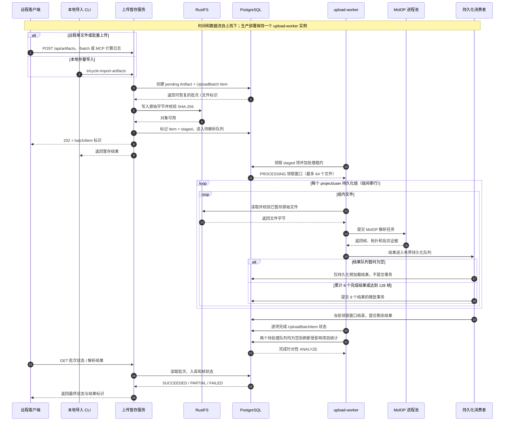

# 开发环境

> English edition: [Development environment](en/development.md).

## 前置条件

- `uv 0.9` 或更高版本
- Docker 与 Docker Compose
- Linux/amd64 开发环境
- 能够访问 PyPI 以安装 MolOP/MolGR 发布包

项目首个支持的 Python 版本是 3.12，具体解释器和全部 Python 依赖由
`.python-version` 与 `uv.lock` 固定。

`pyproject.toml` 的 `[tool.uv] cache-dir` 把 uv 的包缓存放在仓库内的
`.uv-cache/`（已被 `.gitignore` 排除）。这样在无法写入用户缓存目录
（如 `~/.cache/uv`）的受限 shell 里 `uv run` 依然可用；不需要时可以删除
`.uv-cache/`，下次 `uv run` 会重新下载依赖。

## 初始化

```bash
uv sync --python 3.12
```

需要覆盖开发默认值时，基于 `.env.example` 创建 `.env`。默认配置只监听
`127.0.0.1`，数据库账号和密码仅用于本地开发。

完成初始化后，使用以下一个命令启动支持热更新的宿主机开发服务：

```bash
make dev
```

该命令会在宿主机上同时启动组合 API 和 Vite 前端，并显式覆盖本地数据库、RustFS、认证模式与
监听地址；因此不会继承两主机 `.env` 中的远端数据服务端点。Python 源码修改会触发 API reload，
前端源码修改由 Vite HMR 更新；浏览器访问 <http://127.0.0.1:5173/>。按 `Ctrl-C` 只停止 API
和前端进程。

如果需要把 PostgreSQL/RDKit、RustFS 和本地 Keycloak 也一起拉起，使用 `make dev-stack`。

### 远程 Compute 容器联合压力测试

当 `.env` 使用远程 PostgreSQL/RustFS endpoint 时，使用 Docker Compose 的 compute overlay
运行应用容器。容器内的 Python 进程可以访问数据主机的局域网地址：

```bash
docker compose -f compose.yaml -f compose.compute.yaml up -d --build --wait
make benchmark-remote-upload-resources \
  REMOTE_BENCHMARK_FIXTURE=/Users/hx_group/proj/tricycle-data/complete_set \
  REMOTE_BATCH_SIZES="1 8 32"
```

该 benchmark 会实际执行 `ArtifactUploadService.upload_batch()`，记录 PostgreSQL SQL 数量、
RustFS 写入和所有阶段耗时。每批测试使用外层事务回滚数据库，并删除本批新建的 RustFS 对象，
不会留下压力测试数据。每批上传前会检查内容 SHA-256 在 PostgreSQL 中不存在、当前/上一小时
的 RustFS 对象不存在，且批内所有内容哈希唯一；大于默认 64 文件的临时预算可通过
`REMOTE_BENCHMARK_MAX_BATCH_FILES` 和 `REMOTE_BENCHMARK_MAX_BATCH_BYTES` 覆盖。

使用真实计算文件时，将完整快照只读挂载到 benchmark 容器；目录模式只选取不同的 `.log`/`.out`
文件并使用原始字节，不会向内容追加 nonce：

```bash
docker compose -f compose.yaml -f compose.compute.yaml run --rm --no-deps \
  -v "$PWD:/workspace:ro" \
  -v /Users/hx_group/proj/tricycle-data/complete_set:/remote-data:ro \
  api /app/.venv/bin/python /workspace/scripts/benchmark_remote_upload_batch.py \
  --fixture /remote-data --batch-sizes 8 16 32
```

这里只接受真实 Gaussian/ORCA 文件或目录，禁止使用仓库中的合成 fixture；如果某一批触发 PostgreSQL 的
`TRICYCLE_QUERY_STATEMENT_TIMEOUT_MS`，该批应视为失败，而不是用放宽超时后的结果代表当前生产配置。

## 数据库

启动明确版本 tag 的 PostgreSQL/RDKit 容器：

```bash
docker compose up -d --wait postgres
uv run alembic upgrade head
make bootstrap-development
```

检查容器和 migration：

```bash
docker compose ps
uv run alembic current
uv run alembic check
```

停止数据库但保留开发数据卷：

```bash
make db-down
```

不要在应用启动代码中调用 `SQLModel.metadata.create_all()`。所有 schema 变更都应
通过 Alembic revision 完成；生产 downgrade 不自动删除 RDKit extension。

## Artifact 存储

原始 Gaussian/ORCA 文件使用 RustFS 保存，具体边界见
[数据模型与存储边界](data-model.md)。启动明确版本 tag 的 RustFS：

```bash
make storage-up
```

默认 S3 API 为 `http://127.0.0.1:19000`，Console 为
<http://127.0.0.1:19001>。开发凭据和 bucket 见 `.env.example`，仅用于本地环境。

运行真实对象往返测试：

```bash
make test-storage
```

测试覆盖 bucket 创建、put/head/get、SHA-256 校验、delete 和删除后 404。当前固定的
RustFS `1.0.0-beta.8` 尚非 stable release；升级 tag 或 digest 必须重新执行该测试。
生产和开发 Compose 默认设置 `RUSTFS_COMPRESSION_ENABLED=true`，启用 RustFS 磁盘层
压缩。该压缩不改变 S3 GET/HEAD 返回的逻辑原始字节，也不改变 PostgreSQL 中记录的
Artifact SHA-256 和大小；`.gz`、图片、音视频、PDF 等内建排除类型不会重复压缩。

同时启动 PostgreSQL/RDKit、RustFS 与本地 Keycloak，并验证数据基础设施：

```bash
make infra-up
uv run alembic upgrade head
make test-infra
```

只停止 RustFS 使用 `make storage-down`，只管理 Keycloak 使用 `make auth-up` / `make
auth-down`；停止全部容器并保留 named volumes 使用 `make infra-down`。

## API

### 认证与授权

开发环境默认使用 `TRICYCLE_AUTH_MODE=development`，每个受保护请求映射到
`make bootstrap-development` 显式创建的固定开发用户。Alembic migration 只创建 schema，
不会创建任何用户、组织、项目或权限。用户、外部身份、组织、项目和成员关系均保存在
PostgreSQL。

生产环境必须设置 `TRICYCLE_ENVIRONMENT=production` 和
`TRICYCLE_AUTH_MODE=oidc`，并配置 `TRICYCLE_OIDC_ISSUER`、
`TRICYCLE_OIDC_AUDIENCE`、`TRICYCLE_OIDC_JWKS_URL`。服务只验证外部 JWT 并保存
`issuer + subject` 映射，不保存本地密码。

浏览器使用 OIDC authorization-code flow：`/api/auth/login` 负责 state/nonce，回调后只把
随机 session token 的 SHA-256 摘要写入 `auth_session`，原始 token 通过 HttpOnly、SameSite
Cookie 返回浏览器。前端请求必须携带 Cookie；退出、单会话撤销和“撤销其他会话”都会立即
使数据库会话失效。不存在本地密码注册页，用户注册由 OIDC 身份提供方负责，首次通过 OIDC
登录时自动创建本地账户。用户可以创建组织并自动成为 owner，再创建第一个项目；也可以通过
邀请加入已有项目。OIDC 邮箱是身份提供方的权威字段，账户页只允许修改显示名称，
避免通过修改本地邮箱冒领项目邀请。

浏览器退出会先撤销本地 session Cookie；OIDC 回调另外把 ID Token 保存在独立的 HttpOnly
Cookie 中，仅用于向 provider 的 `end_session_endpoint` 提供 `id_token_hint`，不会写入数据库。
退出完成后两个 Cookie 都会清除，再回到应用。若 provider 没有提供该端点，系统仍会完成
本地退出。生产 HTTPS 部署应设置 `TRICYCLE_SESSION_COOKIE_SECURE=true`。

#### MCP 客户端令牌

浏览器登录使用 HttpOnly session Cookie，Cookie 不会暴露给 Claude、Cursor 等外部客户端。
登录后打开 `/nexusx`，在 UseCase MCP 卡片中生成独立的 MCP access token。生成响应中的
`access_token` 原文只返回一次，页面会把它填入各客户端配置；客户端实际发送：

```http
Authorization: Bearer mcp_<generated-value>
```

服务端只保存 SHA-256 摘要。账户页可以查看 token 名称、到期时间和最近使用时间，并撤销
token；撤销后原值立即失效。对应 API 为：

| 方法 | 路径 | 作用 |
| --- | --- | --- |
| `POST` | `/api/auth/mcp-tokens` | 创建 token（请求 `{ "name": "Cursor" }`，原文只在响应中出现一次） |
| `GET` | `/api/auth/mcp-tokens` | 查看当前账户的 token 元数据，不返回原文 |
| `DELETE` | `/api/auth/mcp-tokens/{id}` | 撤销当前账户的 token |

开发模式仍允许不带 token 的本地请求；如果使用 MCP token，服务端仍会校验其有效期和撤销
状态，并只允许该 token 访问 `/mcp/`，不会把它当作通用 REST/GraphQL 凭据。生产模式的 MCP
请求必须携带 MCP token 或由受信任的 OIDC access token 认证。

#### MCP 组织、项目和计算日志操作

文件备注由 update_artifact_notes 管理。它要求当前用户在文件所属项目拥有
artifact:manage 权限，只修改 PostgreSQL 中的用户备注，不修改 RustFS 原始文件；
传入空值可以清除已有备注。

MCP token 是用户级凭据，不绑定固定组织、项目或静态 scope。每次调用都会按 token 对应的
用户重新读取当前组织/项目成员关系，因此用户被加入或移除组织后，MCP 权限会同步变化；
撤销 token 也会立即生效。所有以下工具都要求有效 MCP/OIDC 身份，业务权限由服务层再次校验。

| 范围 | MCP 工具 | 权限边界 |
| --- | --- | --- |
| 组织 | `list_organizations`、`create_organization` | 列出当前用户可见组织；创建后当前用户自动成为 owner |
| 组织成员 | `list_organization_members`、`upsert_organization_member`、`remove_organization_member` | 成员可查看；owner/admin 可管理；不能移除或降级最后一个 owner |
| 项目 | `create_project`、`list_projects`、`get_project`、`update_project` | 创建要求组织 owner/admin；修改要求项目 manager 或组织 admin |
| 项目数据清理 | `preview_project_cleanup`、`delete_project_data` | 仅项目 manager 或组织 admin；删除工具要求 `confirmation` 精确等于项目 slug，并物理删除项目科学数据、上传队列和未共享 RustFS 对象；项目、成员和审计记录保留 |
| 单文件清理 | `delete_artifact` | 需要项目 `artifact:delete`；保留 ArtifactFile tombstone 以维持单文件来源审计 |
| 文件备注 | `update_artifact_notes` | 需要项目 `artifact:manage`；只修改 PostgreSQL 中的用户备注，不修改 RustFS 原始文件 |
| 项目成员 | `list_project_members`、`upsert_project_member`、`remove_project_member` | 项目 manager 或组织 admin；服务层保留最后一个 project manager |
| 项目邀请 | `list_project_invitations`、`create_project_invitation`、`revoke_project_invitation`、`resend_project_invitation`、`accept_project_invitation` | 项目 manager 或组织 admin；接受邀请仍校验登录邮箱匹配 |
| 审计 | `list_project_audit` | 项目 manager 或组织 admin |
| 计算日志 | `upload_calculation_log` | 需要目标项目 `artifact:upload`；只在请求中完成大小、授权和 RustFS 暂存，MolOP/持久化由 worker 异步完成 |

`upload_calculation_log` 接收标准 Base64 的 `content_base64`，不接受 Data URL 前缀，单文件上限
沿用 `TRICYCLE_MAX_UPLOAD_BYTES`（默认 64 MiB）。调用返回的是 durable `UploadBatch` 和
item 的 `staged`/`pending` 状态；MCP 的 `success=true` 只表示原始文件已经写入 RustFS
并进入解析队列，不表示 MolOP 已完成。通过批次查询接口读取最终的 `ingestion_status`、
`parse_revision_id`、帧数量和 TS 推断结果。

#### FastMCP Apps 交互式工具

MCP server 同时注册了 FastMCP App 的 `open_calculation_log_workspace` 交互式工具。
支持 MCP Apps 的客户端会打开 Prefab UI：先从当前用户有 `artifact:upload` 权限的活动项目
中选择目标项目，再拖放或选择一个或多个日志文件，最后一次性提交为一个 durable
`UploadBatch`。文件内容只在 UI 提交动作中传给 app-only 的 `stage_calculation_logs` 后端
工具；该工具不会出现在模型可见的普通工具列表中，且每次调用仍由当前 MCP token 对应的
用户重新校验项目权限。

这个 App 不使用 FastMCP 内置的会话内存文件存储：当前 MCP 使用无状态 Streamable HTTP，
内存文件会跨请求丢失。Prefab 的提交动作直接复用 `UploadBatchService.create_and_stage`，
因此 RustFS 暂存、批次状态、统一 upload-worker/MolOP 进程池和后续持久化与 REST、浏览器、
CLI 及 `upload_calculation_log` 完全相同。不支持 MCP Apps 的客户端仍可使用上表中的直接
MCP 工具。

普通认证请求只读会话；`last_seen_at` 最多每 5 分钟条件更新一次。过期会话和撤销超过 30 天
的会话由调度器定期执行 `make auth-session-cleanup`（或
`uv run tricycle-auth-session-cleanup --revoked-retention-days 30`）清理。该命令输出 JSON
删除计数，适合 cron、systemd timer 或 Kubernetes CronJob；不要放进 API 请求路径。

项目创建页通过 `GET /api/organizations` 获取组织角色，因此即使组织还没有项目，owner/admin
也可以创建第一个项目。邮箱邀请在开发环境默认为 `link_only`，接口返回可复制的接受链接；
生产环境建议设置 `TRICYCLE_EMAIL_DELIVERY_MODE=smtp` 以及 `TRICYCLE_SMTP_*` 参数。邀请记录
会保存 `pending`、`link_only`、`sent` 或 `failed` 投递状态，发送失败可调用重发接口，不会
丢失邀请记录。

本地 Keycloak 可由 `docker compose up -d keycloak` 启动，realm 允许开发环境自助注册，并
预置账号 `development / development-password`。启用本地 OIDC 时，按 `.env.example` 配置
issuer、client secret、回调 URI 和前端地址，并执行 `uv run alembic upgrade head`。realm
JSON 只会在空 Keycloak volume 首次导入；已有开发 volume 需要通过 Keycloak 管理界面同步
realm 配置，或明确重建开发身份数据。

生产部署应由一个 HTTPS origin 提供 `frontend/dist` 和 `/api/*`。可从
`infra/caddy/Caddyfile` 开始配置 SPA fallback 与 FastAPI 反向代理；该示例对全部
`/api/*` 关闭共享缓存，并强制 `Cache-Control: private, no-store`。若外层还有
Cloudflare，必须另建 Cache Rule，使 URI path 以 `/api/` 开头的请求 bypass cache；应用响应头
不能纠正已配置的强制边缘缓存规则。仓库 Caddy 配置不再添加请求体大小或请求速率限制，并将
长请求读写超时设为一小时；上传大小、文件数量、并发和查询预算统一由应用配置校验。若外层
代理另设更小限制，仍以外层限制为准。

| 接口 | 匿名 | 已认证用户 |
| --- | --- | --- |
| `GET /api/artifacts` | 仅列出 `public` | 公开文件和有权项目内文件 |
| `GET /api/artifacts/{id}/preview` | 公开文件 | 公开文件和有权项目内文件 |
| `GET /api/artifacts/{id}/download` | 公开文件 | 公开文件和有权项目内文件 |
| `GET /api/auth/me` | `401` | 当前用户、组织/项目角色和权限 |
| `GET /api/organizations` | `401` | 当前用户可访问的组织和创建项目权限 |
| `POST /api/organizations` | `401` | 创建组织，当前用户自动成为 owner |
| `POST /api/artifacts` | `401` | 需要目标项目 `artifact:upload` 权限 |
| `POST /api/artifacts/batch` | `401` | 同一项目内独立处理多个文件 |
| `POST /api/artifacts/validate` | `401` | 只 probe/解析，不写存储或数据库 |
| `POST /api/artifacts/{id}/reparse` | `401` | 校验已存 bytes，删除旧 parse materialization 后从 revision 1 重建 |
| `PATCH /api/artifacts/{id}` | `401` | 项目 manager 修改显示文件名或可见性 |
| `DELETE /api/artifacts/{id}` | `401` | 需要项目 `artifact:delete`，退役记录并清理对象 |
| `GET/POST /api/projects` | `401` | 可含归档项目；创建要求组织 owner/admin |
| `GET/PATCH /api/projects/{id}` | `401` | 查看项目；修改要求 project manager 或组织管理员 |
| `/api/projects/{id}/members` | `401` | 项目成员列表、添加、改角色和移除 |
| `GET /api/users?project_id=...` | `401` | 项目 manager 搜索可添加的活跃用户 |
| `GET/PATCH /api/users/...` | `401` | system organization 管理员查询和启停用户 |
| `/api/auth/sessions` | `401` | 当前账户会话列表和撤销 |
| `/api/projects/{id}/invitations` | `401` | project manager 创建、列出和撤销邮箱邀请 |
| `POST /api/projects/{id}/invitations/{invitation_id}/resend` | `401` | 重发未接受的邮箱邀请 |
| `POST /api/auth/invitations/{token}/accept` | `401` | 登录邮箱匹配后接受一次性项目邀请 |
| `/api/auth/audit`、`/api/projects/{id}/audit` | `401` | 账户或项目管理审计记录 |
| 其他 REST、GraphQL、MCP、depiction 接口 | `401` | 需要有效身份 |

公开文件请求携带无效 `Authorization` header 时仍返回 `401`，不会降级为匿名。
统一文件上传已开放，新建 Artifact 固定为 `project`；可见性修改尚未开放。所有本地、远程、
单文件和批量入口都先校验权限，在 PostgreSQL 建立 `pending` Artifact 与 UploadBatch item，
再把原始对象写入 RustFS；对象校验通过后 item 变为 `staged`，由独立 upload-worker 自动
领取。worker 从 RustFS 读取并校验对象，使用所有上传会话共享的 MolOP 进程池解析，再由
有界数据库消费者持久化。HTTP/MCP 请求不执行 MolOP，也不等待解析完成。写入、校验或状态
提交失败时，生命周期补偿 Hook 立即定点删除未变成 `available` 的本次对象和 pending 预约行，
不保留 `missing` 垃圾记录。Artifact DELETE 保留 `retired` tombstone，RustFS 临时故障时
可重复请求继续清理。
退役来源不会继续参与详情、下载和派生事实可见性；同一项目以相同 Artifact 类型重新上传
相同 bytes 会恢复原 tombstone 和既有解析历史。计算输出由 worker 统一拆分并录入所有 MolOP
帧；检测到 TS 帧时额外创建或复用同一反应，并保存 TS CalculationFrame 到反应的推断溯源。
格式由 MolOP probe 从内容识别；文件名、扩展名、目录结构、manifest 和上传顺序都不参与
化学身份。批量大小只影响 RustFS 暂存和领取窗口，不会为每个会话创建解析进程；所有 worker
任务在进程内共享同一个有界 MolOP 进程池，并按文件隔离失败。
生产 OIDC 用户首次登录后才进入本地用户目录；首次 system administrator 需要部署侧将该
用户加入 system organization 并授予 owner/admin，API 不允许普通项目 manager 提升全局
账号权限。

开发环境可使用 migration 创建的默认项目测试 multipart 上传：

```bash
curl -sS http://127.0.0.1:8000/api/artifacts \
  -F project_id=00000000-0000-7000-8000-000000000201 \
  -F artifact_kind=calculation_output \
  -F file=@path/to/transition-state.log

curl -sS http://127.0.0.1:8000/api/artifacts/batch \
  -F project_id=00000000-0000-7000-8000-000000000201 \
  -F artifact_kind=calculation_output \
  -F files=@path/to/reactant.log \
  -F files=@path/to/transition-state.out \
  -F files=@path/to/single-point.data

curl -sS http://127.0.0.1:8000/api/artifacts/validate \
  -F project_id=00000000-0000-7000-8000-000000000201 \
  -F file=@path/to/unstructured-upload.bin

curl -sS -X POST \
  http://127.0.0.1:8000/api/artifacts/00000000-0000-0000-0000-000000000000/reparse
```

响应给出 artifact/ingestion ID、源帧数、TS 帧数，以及每个 TS 帧复用的
logical/mapped reaction ID，以及本次 `parse_revision_id/parse_revision_created`。同一文件
普通重复上传返回相同 revision；显式 reparse 会先删除 Artifact 的全部旧 ParseRevision 和
revision-owned 结果，再从 revision 1 建立新的结果。解析或持久化失败时 ingestion 标记为
`failed`，不会恢复已经删除的旧结果。
非计算 artifact 只返回存储结果，不创建 ParseRevision 或 CalculationFrame。

历史上若同一 Artifact 存在多个 ParseRevision，可先检查候选集，再使用统一
RustFS/MolOP/持久化路径修复：

```bash
uv run python scripts/reparse_overlapping_artifacts.py --dry-run
uv run python scripts/reparse_overlapping_artifacts.py \
  --batch-size 32 \
  --state-file .tmp/reparse-overlapping-artifacts-clean-first.jsonl
```

该脚本选择存在多个 ParseRevision 的计算 Artifact（包括历史 `quarantined` revision），先
完成全部清空阶段，再开始解析阶段；因此不会把旧 revision 留在数据库中。JSONL 检查点记录
manifest、`clear` 和 `reparse` 三个阶段，支持中断后继续，失败和 partial 文件不会被标记为
已完成。不要复用旧的仅记录解析结果的检查点。

如果只需要清理明确的一组文件，使用统一的按 ID 清理命令。它在一个授权数据库事务中以
集合操作删除全部旧 ParseRevision 及其 revision-owned 结果，保留 ArtifactFile/RustFS 原始文件，
并把对应 ingestion 重置为 `pending`，之后由 upload-worker 自动重新解析：

```bash
uv run python scripts/clear_artifact_parse_results.py \
  --artifact-id '<artifact-uuid-1>' \
  --artifact-id '<artifact-uuid-2>'

uv run python scripts/clear_artifact_parse_results.py \
  --artifact-id-file .tmp/artifact-ids.txt
```

ID 文件支持空格、逗号和换行分隔，也支持 `#` 注释；同一 ID 会自动去重。该命令只清理解析
物化结果，不删除 RustFS 对象或 Artifact 目录记录。

### 上传补偿与可选 RustFS 垃圾回收

先完成迁移，再运行一次 GC：

```bash
uv run alembic upgrade head
make storage-gc
```

正常上传失败由默认启用的生命周期 Hook 定点补偿，不需要列举 bucket。定期 GC 是处理进程
强制终止、机器故障、外部写入和 Hook 失败的可选安全网；需要最终收敛保证的生产环境可通过
cron、systemd timer 或 Kubernetes CronJob 低频调用 `uv run tricycle-rustfs-gc`，不要在
FastAPI 多 worker 内启动后台循环。默认每次保留一小时
宽限期，并只列举上次成功水位之后的 `uploads/YYYY/MM/DD/HH/` 分区。可用环境变量调整：
`TRICYCLE_STORAGE_GC_GRACE_PERIOD_SECONDS`、`TRICYCLE_STORAGE_GC_INITIAL_LOOKBACK_SECONDS`
和 `TRICYCLE_STORAGE_GC_PARTITION_CLOCK_SKEW_SECONDS`。运行结果以 JSON 输出，并同时写入
PostgreSQL 审计表；失败退出码非零且不推进水位。

GC 保留 `available` Artifact；对超过宽限期、仍未发布的 `pending`，在内容
identity lock
内删除 RustFS 对象（若存在）和数据库预约行。不要把失败预约转成长期 `missing` 记录，也
不要用该规则删除已有 ParseRevision、ingestion、manifest 或 binding 的历史 Artifact。

原有单进程组合应用仍可启动：

```bash
uv run tricycle-api
```

按照 NexusX demo 将四个非 REST 传输拆分到独立进程：

```bash
make serve-nexusx
```

| 前端代理路径 | 模式 | 默认上游 |
| --- | --- | --- |
| `/docs` | 项目组合 API，包含 Core 和 UseCase REST | 组合 API `8000/docs` |
| `/nexusx/graphql` | Direct-list GraphQL，只读直接列表 | 组合 API `8000/graphql-playground` |
| `/nexusx/paginated-graphql` | Paginated GraphQL，`items + page` | 组合 API `8000/graphql` |
| `/nexusx/mcp/` | UseCase MCP，四层渐进披露 | 组合 API `8000/mcp/` |
| `/nexusx/voyager/` | Voyager 可视化 | 组合 API `8000/voyager/` |

Core API 和 UseCase FastAPI 的独立应用仍保留给兼容性测试和拆分部署；它们不再由
`make serve-nexusx` 默认启动，前端也不重复展示文档入口，日常使用统一打开项目组合 API
的 `/docs`。

浏览器只需要访问前端端口 `5173`。`make serve-nexusx` 仍可启动各传输的独立演示进程，
但它们是代理的内部上游，不应直接暴露；如需拆分上游，可通过 `NEXUSX_*_PROXY_TARGET`
覆盖 Vite 代理，并在生产 Caddy 中同步调整对应路由。独立演示进程的 GraphQL
playground 占用 `8000`，因此不能与默认也占用 `8000` 的 `tricycle-api` 同时启动。

NexusX `ErManager` 当前不接受复合 relationship join。Voyager ER 子图因此暂时省略
`CalculationSegment`、`ManifestArtifactBinding`、`MappedReactionEdge` 和
`WorkflowManifest` 四个模型；数据库表、外键和
其他 API 不受影响。不能为了 Voyager 展示而移除这些复合一致性约束。

组合应用默认地址：

- OpenAPI：<http://127.0.0.1:8000/docs>
- `GET /health/live`：进程存活检查，不访问数据库
- `GET /health/ready`：检查 PostgreSQL、RDKit extension 和 RustFS bucket
- `POST /api/{service}/{method}`：NexusX 从白名单 use case 生成的 REST
- `POST /graphql`：NexusX Compose GraphQL HTTP endpoint
- `GET /graphql`：开发环境 GraphiQL；生产环境返回 404
- `GET /graphql/schema`：Compose schema SDL
- `POST /graphql-playground`：直接列表、只读 Compose GraphQL endpoint
- `GET /graphql-playground`：仅供前端 `/nexusx/graphql` 代理的开发环境 GraphiQL
- `GET /graphql-playground/schema`：直接列表 schema SDL
- `/mcp/`：无状态 Streamable HTTP MCP endpoint

浏览器前端源码位于 `frontend/`，使用 Vue 3 + Vite 构建，ChemDoodle Web Components
11.0.0 官方 JS/CSS/license 位于 `frontend/public/vendor/chemdoodle/`。FastAPI
不提供首页或前端静态文件。开发时运行 `make serve-frontend`，访问
<http://127.0.0.1:5173/>；Vite 将 `/api`、`/health`、`/docs` 和 `/nexusx/*` 代理到组合
FastAPI，目标可通过 `VITE_API_PROXY_TARGET` 调整。拓扑图片由
`GET /api/depictions/topology/{topology_id}.svg`
生成；ChemDoodle 画布使用 `GET /api/depictions/topology/{topology_id}.mol` 返回的
2D molfile，两个接口都从数据库 RDKit `mol` 副本派生且不修改持久化对象。

`make frontend-build` 将生产文件写入 `frontend/dist`。该目录不进入 Python wheel，
应交给静态服务器或 CDN；反向代理需要将 `/api`、`/health`、`/docs`、`/openapi.json` 和
`/nexusx/*` 转发到 FastAPI。跨域独立部署时可在构建阶段设置
`VITE_API_BASE_URL`，并在 API 网关显式配置允许的前端 origin。

首次运行浏览器测试需要安装 Chromium，且组合 API、PostgreSQL 和 fixture 数据必须
可用：

```bash
npm --prefix frontend exec playwright install chromium
make frontend-test-e2e
```

REST、GraphQL 和 MCP 共用 `SystemService`、`ArtifactQueryService`、
`ArtifactIngestionQueryService`、`LogicalReactionQueryService`、
`MappedReactionQueryService`、`CalculationQueryService`、
`CalculationResultQueryService`、`WorkflowManifestQueryService`、
`StorageGarbageCollectionQueryService`、
`MolecularTopologyDerivationQueryService` 和
`ReactionCommandService`。Direct-list GraphQL 额外提供只读 catalog service，
但包含主配置的全部业务 service。
`UseCaseService` 是 application 层查询边界；FastAPI 路由只处理 HTTP transport，
不得直接查询 ORM。NexusX 只启用显式 `create_reaction` mutation，不提供通用
entity CRUD。

生成的 REST 路由全部使用 `POST`，参数放在 JSON body。例如：

```bash
base_url=http://127.0.0.1:8000
logical_reactions="$base_url/api/logical_reaction_query_service/list_logical_reactions"
create_reaction="$base_url/api/reaction_command_service/create_reaction"

curl -s "$logical_reactions" \
  -H 'content-type: application/json' \
  -d '{"limit": 20, "offset": 0}'

curl -s "$create_reaction" \
  -H 'content-type: application/json' \
  -d '{"reaction":"C1CC1>>C=CC"}'
```

创建反应不接收数据库 ID 或计算文件。后端从 reaction components 自动解析、复用或创建
Formula/Topology；计算文件通过独立导入流程补充 Geometry 和 Frame。

分页 GraphQL 根字段是 service 类名，方法名保持 snake_case：

```graphql
{
  LogicalReactionQueryService {
    list_logical_reactions(limit: 20, offset: 0) {
      items { id reaction_key }
      page { total limit offset }
    }
  }
}
```

NexusX 6.3 及以上版本的 Compose executor 暂不支持 variables；参数必须 inline，带非空
`variables` 的请求返回 HTTP 400。MCP 按开发指南提供四层渐进披露工具：
`list_apps`、`describe_compose_schema`、`describe_compose_method` 和
`compose_query`。

当前运行时使用 NexusX 6.3 及以上版本的 DTO-first Compose executor、严格 selection 校验、
`UseCaseAppConfig`、新版 `create_use_case_voyager` 和 Streamable HTTP MCP server。
NexusX 6.3 及以上版本同时为 federation 的 `page_by_*_in` 根提供声明式默认排序；本项目当前
使用单数据库 member，未启用跨数据库 federation，因此该能力由依赖保留，待新增独立
engine 时通过实体 `__federation_keys__` 与 `__pagination_orders__` 显式开启。为启用
6.3 及以上版本的 Voyager member cluster/color，数据库实体和应用 DTO 登记在一个带
`service_name`、`color` 的 `ErManager`
中，再作为单个 member 交给 `ComposedErManager`。ER 图和 UseCase 图的数据库归属标签及颜色
分别由 `TRICYCLE_NEXUSX_DATABASE_CLUSTER_NAME` 和
`TRICYCLE_NEXUSX_DATABASE_CLUSTER_COLOR` 覆盖。

这个单 member 包装不改变查询、关系或权限边界。本项目的 PostgreSQL 高可用节点通过一个
writer endpoint 对应用呈现为同一个逻辑 engine，节点数量不会变成 NexusX member 数量。
若未来接入真正独立的数据库 engine，应为每个 member 建立互斥实体集合，并在
`ComposedErManager.cross_relationships` 显式声明跨边界关系；不能仅把 PostgreSQL HA
节点列表当作多个 NexusX engine。RustFS、Redis、OIDC 和 SMTP 也不是 ER member。

查询 DTO 只返回稳定业务字段。`ScientificArray` 仅暴露 kind、unit、dtype、shape、
字节数和 SHA-256，不返回矩阵 `data`；RDKit `Mol`、内部 JSONB 和 RustFS 凭据同样
不进入 API schema。

### 查询预算与慢查询

组合 FastAPI、独立 UseCase REST、GraphQL 和 MCP 共用查询预算。默认值定义在
`.env.example`：

| 配置 | 默认值 | 作用 |
| --- | ---: | --- |
| `TRICYCLE_QUERY_STATEMENT_TIMEOUT_MS` | `15000` | 每个 PostgreSQL 连接的 statement timeout |
| `TRICYCLE_SLOW_QUERY_THRESHOLD_MS` | `500` | 记录 SQL 模板和耗时，不记录绑定参数 |
| `TRICYCLE_GRAPHQL_MAX_QUERY_CHARACTERS` | `20000` | GraphQL 文档字符数上限 |
| `TRICYCLE_GRAPHQL_MAX_TOKENS` | `2000` | GraphQL parser token 上限 |
| `TRICYCLE_GRAPHQL_MAX_DEPTH` | `12` | GraphQL AST 最大深度 |
| `TRICYCLE_GRAPHQL_MAX_COMPLEXITY` | `250` | 字段、分页和 fragment 展开的复杂度上限 |
| `TRICYCLE_QUERY_RATE_LIMIT_REQUESTS` | `120` | 管理写操作和未分类请求的固定窗口请求数 |
| `TRICYCLE_READ_RATE_LIMIT_REQUESTS` | `10000` | 登录态、目录、详情、GraphQL 等只读请求数 |
| `TRICYCLE_UPLOAD_RATE_LIMIT_REQUESTS` | `1000` | Artifact 上传、批量上传、验证和重解析请求数 |
| `TRICYCLE_UPLOAD_MAX_CONCURRENCY` | `8` | 单个 API 进程内同时处理的上传请求数 |
| `TRICYCLE_UPLOAD_WORKER_CONCURRENCY` | `2` | durable upload-worker 单次数据库领取的最大文件数 |
| `TRICYCLE_UPLOAD_WORKER_LEASE_SECONDS` | `3600` | worker 处理 lease 的有效期；worker 用心跳续租，过期后可被重新领取 |
| `TRICYCLE_UPLOAD_CLIENT_LEASE_SECONDS` | `900` | HTTP 上传 lease 的恢复阈值；请求中断后超过此时间可回到队列 |
| `TRICYCLE_UPLOAD_WORKER_POLL_INTERVAL_SECONDS` | `1` | upload-worker 轮询 staged 项和过期 lease 的间隔 |
| `TRICYCLE_UPLOAD_WORKER_STATEMENT_TIMEOUT_MS` | `120000` | 后台解析/持久化单条 PostgreSQL statement 的独立超时；交互 API 仍使用 `TRICYCLE_QUERY_STATEMENT_TIMEOUT_MS` |
| `TRICYCLE_MOLECULE_QUERY_RATE_LIMIT_REQUESTS` | `10000` | 分子式、拓扑和几何只读查询的独立固定窗口请求数 |
| `TRICYCLE_DEPICTION_RATE_LIMIT_REQUESTS` | `10000` | 分子 SVG/MOL/SDF 资源的独立固定窗口请求数 |
| `TRICYCLE_QUERY_RATE_LIMIT_WINDOW_SECONDS` | `60` | 限流窗口秒数 |
| `TRICYCLE_STRUCTURE_QUERY_MAX_CHARACTERS` | `16384` | SMILES/SMARTS/reaction 输入长度上限 |
| `TRICYCLE_STRUCTURE_CANDIDATE_LIMIT` | `50000` | 需要逐候选后处理的最大关系行数 |
| `TRICYCLE_MOLOP_BATCH_N_JOBS` | `2` | 同时处理的文件级 MolOP worker 数；使用可复用的 `spawn` 进程池，`-1` 在开发环境使用全部可用 CPU，生产环境必须显式限界 |
| `TRICYCLE_MOLOP_FILE_PARSE_TIMEOUT_SECONDS` | `60` | 10 MiB 文件的 MolOP 解析与 MolGR 帧重建基准时长；更大文件按体积等比例放大，较小文件至少使用该基准；超时文件单独失败，批次继续处理 |

描述符、Murcko scaffold、手性和匹配次数等逐候选计算必须先通过 Formula、
Topology 或
其他廉价关系条件缩小候选集。SMARTS 和带阈值的相似度以 RDKit GiST 谓词筛选后的实际
候选集计数；纯 Top-K 相似度由 fingerprint GiST KNN 和 API 的 `limit <= 500` 限界，
不会仅因整表规模超过候选上限被拒绝。

只读、上传、管理写操作、分子查询和 `GET /api/depictions/*` 分别计数，避免批量上传或卡片图片挤占登录态与目录读取额度。稳定错误语义如下：REST 对预算超限返回 HTTP 413 `query_budget_exceeded`，限流返回
HTTP 429 `query_rate_limit_exceeded` 和 `Retry-After`，数据库超时返回 HTTP 503
`query_timeout`。GraphQL 与 MCP 在 error envelope 的 `extensions.code` 使用相同
code。
PostgreSQL 取消语句后 session 会 rollback 并可继续复用连接；慢查询日志仅保存 SQL
模板和毫秒耗时，不能输出绑定值、结构输入或凭据。

## 质量检查

```bash
make lint
make type
make test
make test-db
make test-storage
make test-infra
```

`make test` 默认跳过真实数据库测试；数据库启动并完成 migration 后，使用
`make test-db` 验证 RDKit extension、MolAlchemy `Chem.Mol` 化学图往返、构象精度
边界、自定义 property 丢失、子结构查询、GiST 索引和就绪接口。往返契约及升级
检查要求见 [RDKit Mol 对象数据库往返契约](rdkit-mol-roundtrip.md)。

`make test-storage` 验证 RustFS。`make test-infra` 同时启用全部 PostgreSQL/RDKit
与 RustFS 集成测试。普通 `make test` 不访问外部基础设施。

查询成本数据库门可独立运行：

```bash
TRICYCLE_RUN_DATABASE_TESTS=1 uv run pytest -q \
  tests/integration/test_query_cost_database.py \
  tests/integration/test_topology_search.py \
  tests/integration/test_reaction_search.py --no-cov
```

该门验证 statement timeout 后连接恢复、慢查询绑定值脱敏、Formula GIN、Topology/
Reaction RDKit GiST 与 fingerprint KNN、Geometry/Frame B-tree 计划，并把候选上限压低后
验证未索引扫描被拒绝而索引 SMARTS、阈值相似度和 Top-K 不受全表行数误伤。

### 真实 DA fixture

`tests/fixtures/da_bench_minimal` 保存 `C=C + c1scc2c1OCCO2` 环加成的固定子集，
包括两个 reactant、一个 TS 和一个 product 的 Gaussian 日志及源 JSON。日志使用
deterministic gzip，fixture manifest 固定压缩与解压后双 SHA-256；选择的 TS
`conf_01` 具有一个虚频，第 22 帧为 terminal/converged 并可提供 TS Geometry；同一
Geometry 下的其他 Frame 仍作为计算事实保留并可在详情中查看。

普通 `make test` 会解压并用 MolOP 验证帧数、Formula 和逐帧 Topology；`make test-db`
进一步验证 UUIDv7、SQLModel Relationship、PostgreSQL RDKit `mol`、deferred NPY、
Formula -> Topology -> Geometry 与 Revision -> Segment -> Frame 两条主轴的幂等持久化。
测试不依赖 `/mnt/g` 挂载。

基础设施启动并完成 migration 后，可将该 fixture 作为开发数据录入：

```bash
make seed-da-bench
```

### 直接批量导入存量文件

大量存量文件不需要经过浏览器或 HTTP API。`tricycle-import-artifacts` 在服务端进程内递归发现并
指纹化文件，创建 UploadBatch 后把原始文件暂存到 RustFS；它不会在 CLI 进程中调用 MolOP。
独立 upload-worker 自动领取这些 staged item，并用与远程上传相同的共享解析池和持久化路径
完成入库。指纹计算采用有界流水线，不会先扫描并哈希完整目录后才开始暂存；导入默认一次向
队列提供 64 个候选文件，批次窗口只控制暂存背压。需要运行 CLI 的同时保持
`tricycle-upload-worker`（`make dev`/`make dev-stack` 会自动启动），否则文件会安全保留在
RustFS 的 staged 队列中等待 worker。每个文件仍按内容 SHA-256 幂等，单个暂存失败不会回滚
同批其他文件。

#### 文件上传统一时序与数据流

下面的时序图统一描述远程单文件、远程批量、本地 `tricycle-import-artifacts` 和 MCP
计算日志上传。时间和数据流均自上而下；不同入口只在“原始字节来自哪里”这一点上不同。
系统会先在 PostgreSQL 建立 `pending` 预约和批次项，再写入并校验 RustFS；只有对象可用
且 item 变为 `staged` 后，文件才进入待解析队列。worker 领取 staged 对象并真正开始
MolOP/帧处理时，文件级 ingestion 才切换为 `processing`；租约过期会回到 `pending`。
也可以打开[独立可缩放图示](diagrams/upload-processing-sequence.html)。



图中的边界需要这样理解：

- 指纹线程池只负责发现文件和读取 SHA-256，内部上限为 `32`；它不是 MolOP 解析池。`IMPORT_STREAM_QUEUE_SIZE` 只限制指纹结果到候选窗口之间的缓冲。
- `TRICYCLE_MOLOP_BATCH_N_JOBS` 是 worker 内共享 MolOP 进程池的文件级准入上限。API、MCP、
  本地 CLI 和远程批量入口都只负责把文件推进 RustFS/staged 队列，不会在各自会话中创建解析池。
- `pending` 只是写入过程中的可恢复预约和等待队列状态；RustFS 写入和摘要校验成功后才转为
  `staged`，worker 领取后文件级 ingestion 才显示为 `processing`。上传请求不会在 RustFS
  之前或之后直接调用 MolOP。
- worker 领取后把 parser/frame 任务提交到同一个可复用的 `spawn` 进程池。因此 `n_jobs=16`
  表示该服务进程最多同时执行 16 个文件任务，不会为每个 artifact 或上传会话重复创建进程池；
  文件完成或失败后，队列继续补位。取消或超时只结束该文件的任务，已提交的共享池工作由池自行排空。
- 子进程内部的 OpenMP/BLAS native thread 由 `OMP_NUM_THREADS`、`OPENBLAS_NUM_THREADS` 和 `MKL_NUM_THREADS` 控制；推荐都设为 `1`。候选窗口和 native thread 数都不会替代文件级槽位。
- RustFS 暂存批次只负责上传背压；解析 worker 以领取窗口和有界持久化批次形成数据库写入背压。
  暂存检查点记录 batch/item ID，最终解析状态以 UploadBatch 查询结果为准；单文件失败不会回滚
  已暂存或已完成的其他文件。
- `upload-worker` 的单实例是共享 MolOP 池和单一活动持久化消费者的部署边界。API 可以横向扩展；
  不要横向扩展 upload-worker，否则每个进程都会拥有自己的 MolOP 池和持久化消费者。

浏览器、MCP 或远程 API 路径不经过 Import CLI 的指纹线程池和本地候选队列：入口先把字节写入
RustFS 并将 item 标记为 `staged`，独立 `upload-worker` 每轮领取 `TRICYCLE_MAX_BATCH_FILES`
（当前为 64）个文件，按项目/用户交给 `ArtifactUploadService.reparse_batch`。该方法只读取
并校验已有对象，然后委托共享 MolOP 进程池和单一持久化消费者；不会再次上传，也不会建立
第二套解析路径。`TRICYCLE_UPLOAD_MAX_CONCURRENCY` 限制 RustFS 读取槽位，
`TRICYCLE_UPLOAD_WORKER_CONCURRENCY` 只用于旧 pending-ingestion 恢复，
`TRICYCLE_MOLOP_BATCH_N_JOBS` 限制共享解析池准入，三者不能简单相乘。

远程 reparse 的批次边界必须与解析并发分开理解：worker 每轮最多领取 64 个 staged
文件。客户端 `UploadBatch` 只是队列/进度边界，不是持久化边界；即使原始上传是单文件
批次，同一项目/用户的任务也必须在 worker 中合并为一个持久化微批。不同项目/用户的
微批顺序执行，不能并发打开多个项目持久化事务。每个 project/user 微批通过
`reparse_batch` 交给 `upload_batch`，再使用同一个结果队列和单一消费者；其中每 8
个解析结果、累计达到 128 帧（或队列暂时为空）调用一次 `persist_parsed_files`，并在持久化
微批边界提交事务，不能等到整个领取窗口全部解析完成后才写数据库。因此 `64` 只表示领取窗口，
`8` 个文件/`128` 帧是固定的持久化提交微批，实际解析并发仍只由共享 MolOP 池的
`TRICYCLE_MOLOP_BATCH_N_JOBS`（专用主机通常为 `16`）决定。该 durable bulk/reparse
事务还使用上一版的 legacy bulk 热路径：reaction SMILES topology 缓存和单次 set-based
Geometry 匹配保持开启，后来增加的逐文件 concrete/logical/reverse reconciliation 不得
直接插入；项目范围和所有权约束仍然必须执行。修改这些边界前必须同步更新架构说明并用同一
批真实文件复测字节吞吐和失败隔离。

#### 项目级批量变更后的统计刷新

PostgreSQL 的自动 ANALYZE 阈值按整张表计算。单个项目即使刚刚完成大批量删除、导入或
重解析，变更量仍可能小于多项目共享大表的阈值，导致项目列的统计信息继续使用旧估计。
因此这些操作提交完成后会主动刷新项目查询依赖的统计信息：`ProjectDataRemovalService`
在删除事务提交后立即执行一次；统一 `upload-worker` 将本轮处理过的 project ID 放入一个
集合，在 staged 与兼容 pending 队列都为空时一次性执行；优雅停止也会执行最后一次刷新。
连续的单文件上传只要队列未清空就不会各自触发 ANALYZE。

刷新是一个独立的、提交后的维护事务，只针对 artifact、ingestion、parse、frame、geometry、
project geometry catalogue 以及反应 profile 读路径所需的列级统计，不会把 ANALYZE 放进长时间
解析或删除事务。离线的 `reparse_overlapping_artifacts.py`、`reimport_artifact_objects.py`
和 `clear_artifact_parse_results.py` 也在各自项目阶段结束时调用同一服务。需要注意，PostgreSQL
的 ANALYZE 本身是表级操作，project ID 用于合并触发边界和日志标识，而不是把采样限制成
单个项目；刷新失败只记录日志，不回滚已经成功的业务事务。

#### 推荐的导入超参数

先按运行场景选择起始组合。当前部署算力主机的吞吐基准以 16 个文件级 MolOP worker、每个 worker 使用 1 个 native thread 为起点；这不是所有机器的固定最优值，CPU 核数、可用内存、磁盘和 PostgreSQL 延迟不同都需要重新验证。

| 场景 | `TRICYCLE_MOLOP_BATCH_N_JOBS` | `OMP_NUM_THREADS` / `OPENBLAS_NUM_THREADS` / `MKL_NUM_THREADS` | `IMPORT_PIPELINE_WINDOW_FILES` | `IMPORT_STREAM_QUEUE_SIZE` | `IMPORT_COMMIT_BATCH_FILES` |
| --- | ---: | --- | ---: | ---: | ---: |
| 本地开发或低资源主机 | `2` | `1 / 1 / 1` | `16` | `16` | `8–16` |
| 有足够 CPU/内存的部署算力主机（吞吐优先） | `16` | `1 / 1 / 1` | `64` | `64` | `16` |
| 内存或数据库压力较大 | `4–8` | `1 / 1 / 1` | `32` | `32` | `8` |

部署算力主机可以从下面的组合开始；`IMPORT_*` 是 `make import-artifacts` 的命令行变量，`TRICYCLE_*` 和 native thread 变量则应同时放入运行环境或 shell 环境：

```bash
IMPORT_MODE=deployment \
OMP_NUM_THREADS=1 \
OPENBLAS_NUM_THREADS=1 \
MKL_NUM_THREADS=1 \
TRICYCLE_MOLOP_BATCH_N_JOBS=16 \
IMPORT_PIPELINE_WINDOW_FILES=64 \
IMPORT_STREAM_QUEUE_SIZE=64 \
IMPORT_COMMIT_BATCH_FILES=16 \
IMPORT_MAX_TRANSIENT_RETRIES=3 \
IMPORT_PROJECT_ID='<project-uuid>' \
IMPORT_USER_ID='<user-uuid>' \
IMPORT_ROOTS='/data/calculations /data/supplemental' \
IMPORT_STATE_FILE=.tmp/artifact-import.jsonl \
make import-artifacts
```

调参时按以下顺序处理：

- 首先调 `TRICYCLE_MOLOP_BATCH_N_JOBS`，建议按 `2 → 4 → 8 → 16` 递增，每次使用同一批真实文件重新测量。它是 worker 共享解析进程池的文件级准入上限；三个 OpenMP/BLAS 变量应保持为 `1`，不要通过把它们设大来代替文件级并发。生产环境必须使用正整数，不能使用 `-1`。
- `IMPORT_PIPELINE_WINDOW_FILES` 是 RustFS 暂存候选池，不是 parser worker 数；它只影响预取、背压和内存占用。`IMPORT_STREAM_QUEUE_SIZE` 是发现/指纹阶段的缓冲，通常与候选池取相同值。增大这两个值不会增加解析并发；大文件或内存紧张时应优先减小它们。
- 指纹阶段使用独立线程池，当前内部上限为 `32` 个 worker，没有对应的环境变量或 CLI 参数。若统计中的瓶颈在 fingerprint 阶段，应先检查磁盘和 SHA-256 读取开销，不要盲目增大 MolOP 解析并发。
- `IMPORT_COMMIT_BATCH_FILES` 目前仅为旧 CLI 参数保留；worker 的领取窗口和持久化批次由服务端控制，不由本地 CLI 会话创建解析进程。若调整 worker 的提交边界，应同步观察锁竞争、statement timeout 和数据库内存压力。
- `IMPORT_MAX_TRANSIENT_RETRIES=3` 建议保持不变。它只用于死锁、序列化冲突、连接瞬断等瞬态错误；提高它不能修复持续性错误，只会延长失败恢复时间。
- `TRICYCLE_MOLOP_FILE_PARSE_TIMEOUT_SECONDS=60` 是 10 MiB 文件的基准预算，并随源文件大小放大；它是异常文件隔离参数，不是提速参数。慢磁盘或大文件较多时提高，想更快跳过异常文件时降低，但应先确认失败率。
- `TRICYCLE_MOLOP_CAPTURE_SOURCE_EVIDENCE=false` 是上一版高吞吐导入的默认值，适合大规模普通导入；需要 frame role/source locator、source span 和 block hash 等审计证据时显式设为 `true`，并接受额外开销。`TRICYCLE_MOLOP_PARALLEL_FRAME_PERSISTENCE=true` 应保持开启。

浏览器和远程 API 上传使用独立的 durable `upload-worker`，参数不要与本地导入的 `IMPORT_*` 混用。`TRICYCLE_UPLOAD_MAX_CONCURRENCY=8` 限制 RustFS 读取；`TRICYCLE_MAX_BATCH_FILES=64` 是 worker 的领取窗口，持久化提交微批固定为 8 个文件或 128 帧；`TRICYCLE_UPLOAD_WORKER_CONCURRENCY` 仅用于旧 pending-ingestion 恢复。专用算力主机可以把共享解析池 `TRICYCLE_MOLOP_BATCH_N_JOBS` 调到 `16`，并根据 CPU、内存和数据库写入延迟复测。

worker 的 64 个文件是领取窗口，不代表 64 个文件共用一个事务；每个 project/user 微批
通过同一个结果队列和单一消费者处理，并按 8 个文件或 128 帧提交一次。它不改变解析准入；本地
CLI 的 `IMPORT_COMMIT_BATCH_FILES=16` 仍只控制本地事务/检查点频率。三种数字分别属于
解析准入、结果交接和提交边界，不能互相替代。

`TRICYCLE_MAX_UPLOAD_BYTES=64 MiB` 是单文件上限，本地导入也会执行；`TRICYCLE_MAX_BATCH_FILES=64` 和 `TRICYCLE_MAX_BATCH_BYTES=512 MiB` 是 HTTP 批次保护，不是本地导入的吞吐参数。只有在专用内网压测或可信批量客户端中，并且反向代理 body limit、RustFS、PostgreSQL 都已验证有余量时，才临时提高批次上限到例如 `1024` 文件 / `1 GiB`；不要为普通公网 API 修改这些默认值。`TRICYCLE_UPLOAD_WORKER_LEASE_SECONDS=3600`、`TRICYCLE_UPLOAD_CLIENT_LEASE_SECONDS=900` 和轮询间隔 `1` 秒属于故障恢复参数，保持默认值即可。

先启动 PostgreSQL、RustFS、完成 migration 和 development bootstrap，然后执行：

```bash
uv run tricycle-import-artifacts \
  --project-id 00000000-0000-7000-8000-000000000201 \
  --user-id 00000000-0000-0000-0000-000000000002 \
  --state-file .tmp/artifact-import.jsonl \
  /data/archive/reactions /data/archive/supplemental
```

归档解压后的推荐入口是 manifest 模式。先由受控 extractor 生成包含归档
SHA-256、相对路径、staging 路径、文件 SHA-256、大小、媒体类型、Gaussian
标记和选择状态的 JSON manifest，再配置 `TRICYCLE_IMPORT_STAGING_ROOT`：

```bash
TRICYCLE_IMPORT_STAGING_ROOT=/data/staging \
uv run tricycle-import-artifacts \
  --project-id 00000000-0000-7000-8000-000000000201 \
  --user-id 00000000-0000-0000-0000-000000000002 \
  --manifest /data/staging/archive.manifest.json
```

manifest 模式把文件清单注册为数据库中的 durable ImportJob/ImportJobItem，
只会导入 `selection_status=selected` 的条目。服务端会在注册和启动前重新
计算所有条目的 SHA-256，并拒绝 staging 根目录外的路径、符号链接、硬链接、
特殊文件、路径穿越、文件大小或内容变化；清单外新增文件不会被递归隐式导入。
重复注册同一项目的同一 manifest 返回已有任务。任务状态和失败项通过
MCP 的 `get_import_status`、`list_import_failures`、`retry_import_items`、
`pause_import`、`resume_import` 和 `cancel_import` 控制。

参数说明：

- 可以传入多个文件或目录；目录会递归扫描，符号链接不会展开。
- 对 `calculation_output`，已知的 JSON/CSV/TSV/YAML/TOML、结构文件和 Markdown 旁车文件会自动跳过；未知扩展名仍会保留，以兼容不同量化软件。可用 `--include-suffix`（重复传入）建立本地扩展名白名单，或用 `--exclude-suffix` 增加排除项。
- `--pipeline-window-files` 控制一次交给 RustFS 暂存的候选文件数，默认 `64`；也可通过 `IMPORT_PIPELINE_WINDOW_FILES` 传给 `make import-artifacts`。它只形成暂存背压，不创建或限制 worker 的解析进程。
- `--commit-batch-files` 是旧 CLI 参数，为兼容既有调用保留；解析持久化微批由 durable upload-worker 控制，不由本地导入会话直接提交。
- `--stream-queue-size` 只控制文件发现/指纹阶段到流水线窗口之间的有界缓冲，默认 `64`；也可通过 `IMPORT_STREAM_QUEUE_SIZE` 传给 `make import-artifacts`。
- 数据库死锁、序列化冲突、连接瞬断、statement timeout 和 `max_locks_per_transaction` 等瞬态资源错误会自动退避并把失败批次二分；默认每个文件最多重试 `3` 次。耗尽后只记录该文件失败，其他文件继续导入，下一次使用同一 `--state-file` 会再次尝试。
- 默认导入 `calculation_output`，可用 `--artifact-kind input|workflow_manifest|auxiliary` 覆盖。
- `--state-file` 是追加写入的 JSONL 检查点。重复执行会按路径、大小、mtime 和 SHA-256 跳过已成功文件；文件发生变化后会重新导入。
- 使用 `--dry-run` 只扫描并输出统计，不写数据库或对象存储。
- 所有环境都必须显式提供 `--user-id`，该用户需要目标项目的 `artifact:upload` 权限；
  不再默认使用 development user。
- `--manifest` 与目录递归模式互斥；manifest 模式不接受 suffix filter 或 JSONL
  `--state-file`，因为清单选择和 ImportJob 状态是唯一控制面。
- Makefile 对应变量为 `IMPORT_INCLUDE_SUFFIXES`、`IMPORT_EXCLUDE_SUFFIXES` 和
  `IMPORT_MAX_TRANSIENT_RETRIES`；前两个变量使用空格分隔的后缀列表。

也可以使用 Makefile：

```bash
IMPORT_MODE=development \
IMPORT_PROJECT_ID=00000000-0000-7000-8000-000000000201 \
IMPORT_USER_ID=00000000-0000-0000-0000-000000000002 \
IMPORT_ROOTS='/data/archive/reactions /data/archive/supplemental' \
IMPORT_STATE_FILE=.tmp/artifact-import.jsonl \
make import-artifacts
```

`make import-artifacts` 默认继承当前 shell 的数据库、RustFS 和认证配置，适合部署主机或
已通过 `.env` 配置的运行环境，不会静默改写目标端点。上面的开发示例显式选择了
`IMPORT_MODE=development`；其他环境应保留默认的部署模式。

开发模式固定使用本机 PostgreSQL/RustFS 和 development auth；部署模式保留调用者提供的
`TRICYCLE_*` 环境变量。生产导入仍必须提供 `IMPORT_USER_ID`，并使用部署用户的项目权限。

命令最后输出 JSON 统计，包括扫描、跳过、尝试、成功、失败数量和成功字节数；`timings` 字段
还包含发现/指纹/状态筛选/批次上传的分步耗时、每批 `ArtifactUploadService` 解析与持久化阶段耗时，
以及按 SQL 操作类型汇总的语句数量和数据库执行耗时。失败批次会写入检查点并以非零状态退出；
修复原因后重新执行同一个命令即可继续。

该命令会将 manifest 和四个解压后的 Gaussian 日志真实上传到 RustFS，并将反应物、
过渡态、产物及其反应路径写入 PostgreSQL。四个日志的全部 9 个 Link1 segment 和
45 个物理 frame 都会录入；坐标相同的重复终态仍保留为独立 Frame，但共享同一
Geometry。命令可重复执行；相同 fixture 会复用既有记录，并在结束时输出关键 UUID、
逐文件帧数和各业务表行数。

按原文件顺序查看全部优化帧及其能量：

```sql
SELECT
    a.original_filename,
    s.segment_index,
    f.frame_index,
    f.file_frame_index,
    f.frame_role,
    f.optimization_status,
    f.scf_status,
    f.reference_total_energy_hartree,
    t.canonical_isomeric_smiles
FROM calculation_frame AS f
JOIN calculation_segment AS s ON s.id = f.segment_id
JOIN parse_revision AS r ON r.id = f.parse_revision_id
JOIN artifact_file AS a ON a.id = r.artifact_file_id
JOIN geometry AS g ON g.id = f.geometry_id
JOIN molecular_topology AS t ON t.id = g.topology_id
ORDER BY a.original_filename, f.file_frame_index;
```

当前 seed 保存逐帧 Geometry、原文 span/hash、reference total energy、SCF/优化状态、
频率摘要，以及 MolOP 实际解析到的全部受支持数组。MolOP 子模型分别写入 45 个
FrameEnergyResult、49 个 EnergyObservation、40 个 GeometryOptimizationResult、
40 个 CalculationStatusResult、4 个 VibrationResult 和 4 个 ThermochemistryResult。
当前 fixture 共写入 227 条
`ScientificArray`：40 组 forces、45 组 rotational constants、14 组 orbital energies、
18 组 population values、74 组 polarizability/multipole 数组，以及各 4 组 Hessian、
frequencies、reduced masses、vibrational force constants、IR intensities、
normal modes、moments of inertia、rotational temperatures 和 vibrational
temperatures。5 个终态几何
重打印帧在 MolOP 中的 forces 为 `None`，因此保持缺失，不补零或复制相邻帧数据。

`ScientificArray.data` 默认使用 `raiseload` 延迟加载。ORM 查询矩阵载荷时必须显式使用
`undefer(ScientificArray.data)`；列表查询仍只返回 kind、unit、dtype、shape、nbytes、
payload hash 和 metadata。

## 依赖约束

MolOP `>=0.2.18` 与 MolGR `>=0.1.8` 直接从官方 PyPI 安装；`pyproject.toml` 声明最低
兼容版本，`uv.lock` 记录当前解析版本。项目不再使用内网 Git source 或
`override-dependencies`。

MolOP 0.2.18 的文件级和帧级统一 `comments` 容器分别写入
`ParseRevision.comments` 和 `CalculationFrame.comments`；文件详情和计算帧详情会展示这些
解析出的只读 comments。它们与可编辑的 `ArtifactFile.notes` 是两个独立字段。

更新 MolOP、MolGR、OpenBabel 或 RDKit 时，
必须重新运行：

```bash
uv lock --python 3.12
uv sync --python 3.12 --frozen
uv pip check
uv run python -c "import molop, molgr, openbabel, rdkit"
make check
make test-db
```
